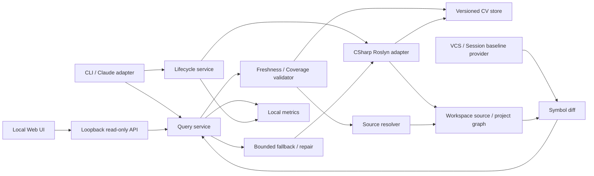

# Architecture

## 상태와 적용 조건

2026-09-20에 `b16df53`의 11개 사용자 결정, [ADR 001](../decisions/001-product-path.md), [ADR 002](../decisions/002-validation-outcome.md), [ADR 003](../decisions/003-next-step.md)을 반영했다. TASK-006~016의 **독립 C#/.NET engineering prototype**과 재현 가능한 증거는 보존한다. TASK-016은 품질·안전성을 통과했지만 동결된 source-byte 효율 gate에 실패해 최종 **No-Go**다. 신규 제품화는 중단하며 Web UI·Perforce는 요구를 보존한 `Blocked` 상태이고, 자동 GC는 삭제 없는 측정·정책 제안까지 착수 가능하나 GC 구현과 자동 삭제 활성화는 실측 수치 승인 전까지 `Blocked`다. 재개 조건과 남은 FUP는 [user-confirm.md](user-confirm.md)를 따른다.
## Architecture Overview



기본 프로세스 경계는 단일 .NET 실행 파일 + 라이브러리다(UC-003). CLI와 향후 MCP host가 동일한 Core 계약을 호출한다. UC-003 A에 따라 초기 npm launcher·C# worker IPC·C++ worker 동시 구현은 제외한다. 외부 compiler backend를 도입할 때에만 worker protocol을 설계한다.

## Technology Stack

| 영역 | 추천안 | 이유·대안 | 결정 |
|---|---|---|---|
| Core·CLI | C#/.NET, `global.json`에 구현 시 지원 SDK 고정 | Roslyn과 한 runtime; TypeScript launcher는 배포 편의와 IPC 비용의 교환 | UC-003 |
| C# 분석 | Roslyn syntax/semantic/workspace APIs | 선언과 프로젝트 의미를 함께 다룸; LSP 재사용은 Phase 1 비교군 | UC-001/002 |
| 저장 | UTF-8 JSON manifest + JSONL `.cv` shards | PoC 검사·손상 주입이 쉬움; 대규모 random access 비용이 크면 SQLite 검토 | UC-004 |
| 검색 | snapshot별 정규화 이름·ID의 메모리 인덱스 | 결정적인 조회, 원문 body는 저장하지 않음 | UC-006 |
| 변경 감지 | 훅/파일 watcher + 조회 시 hash 검증 + inventory reconciliation | 이벤트 유실에 대비; 이벤트는 최적화 힌트 | UC-004 |
| 외부 노출 | CLI JSON, 이후 MCP stdio | 독립 Core 유지; 훅은 lifecycle만 담당 | UC-009 |
| 로컬 Web UI | .NET loopback host + Blazor Server(InteractiveServer) frontend | Core 재사용; FUP-006 확정으로 frontend stack을 Blazor Server/ASP.NET Core로 고정 | UC-011, FUP-006 |
| 테스트 | .NET 테스트 프로젝트 + golden fixtures + integration process tests | 파서/저장/CLI/동시성 책임을 나눠 검증 | UC-003 |

Roslyn Workspaces는 solution/project/document 모델과 syntax tree·semantic model 접근을 제공한다. 이는 C# 선택의 기술적 근거일 뿐, 대형 솔루션의 속도나 정확도를 보증하지 않는다. [Microsoft 문서](https://learn.microsoft.com/en-us/dotnet/csharp/roslyn-sdk/work-with-workspace).

버전 번호와 NuGet/MCP package는 현 단계에서 임의로 고정하지 않는다. TASK-006에서 선택 SDK와 호환되는 안정 버전을 확인하고 lock·재현 가능한 restore를 포함한다.

## 기존 도구와의 경계

| 비교 대상 | 확인된 기능 | CV 검증 질문 |
|---|---|---|
| LSP | 심볼·정의·참조 관련 표준 요청 | 별도 CV store 없이 충분한가? 실제 서버 capability를 확인했는가? |
| Serena | LSP backend, C#·C/C++ 지원, 심볼·참조 탐색 | 얇은 lifecycle/출력 조정만으로 같은 이득을 얻는가? |
| Aider repo-map | 토큰 예산 안의 코드 구조 지도 | 대략적 맥락 제공만으로 원문 읽기량이 충분히 줄어드는가? |
| grep + 범위 읽기 | 현재 사용 도구로 구성할 실험 조건 | 낭비가 도구 부재보다 지시·사용 습관 때문인가? |

근거: [LSP](https://microsoft.github.io/language-server-protocol/specifications/lsp/3.17/specification/), [Serena](https://github.com/oraios/serena), [Aider repo-map](https://aider.chat/docs/repomap.html). 2026-09-19 확인. 기존 도구에 특정 기능이 절대로 없다는 주장은 하지 않는다. 합성 smoke에서는 C# LSP와 Serena 실행 환경이 없어 C/D가 unavailable이었으므로 독립 엔진의 우위를 비교하지 못했다.

독립 엔진 선택은 제품 가치 입증이 아니라 engineering prototype 구현 승인이었다. TASK-016은 [ADR 001](../decisions/001-product-path.md)의 동결 기준으로 실행됐고 E 품질 `6/6`, recall `27/27`, Critical `0`을 달성했지만 source bytes는 B 대비 NAV `9.75% 감소`, DIFF `1,618.9% 증가`로 두 task 모두 `20% 이상 감소` 기준에 실패했다. 실제 model token은 미측정이므로 token 효율은 별도로 `inconclusive`이며 source bytes/lines로 대체하지 않는다.
## 경로와 재평가 계약

[ADR 003](../decisions/003-next-step.md)은 TASK-016 **No-Go**를 최종 적용한다. 현재 architecture의 Core·CLI·MCP·Claude adapter는 검증 가능한 기술 prototype으로 남고, 신규 독립 엔진 제품화는 중단한다.

| 대상 | 현재 처리 | 재개 조건 |
|---|---|---|
| Core·CLI·MCP prototype | TASK-006~016 산출물과 benchmark artifact 보존 | 유지보수 목적을 벗어난 제품 작업은 새 결정 필요 |
| TASK-018 Web UI | `Blocked`; 얇은 연동은 사람 중심 UI·로컬 Web 보안/API gap을 충족하지 않음. FUP-006 확정(Sample 1 + Blazor Server)으로 UI 방향은 정해짐 | 대표 corpus·실제 model token·NAV/DIFF source-byte 계약 개선과 protocol revision을 반영한 새 ADR(005 동결 → 006 결과) |
| TASK-019 Perforce | `Blocked`; 얇은 연동은 CL별 bytes/baseline·mapping gap을 충족하지 않음. FUP-007 계약 확정(실제 p4 환경은 미제공)과 baseline provider 추상화 선행 필요 | 대표 corpus·실제 model token·NAV/DIFF source-byte 계약 개선과 protocol revision을 반영한 새 ADR(005 동결 → 006 결과); 실제 p4 환경 |
| TASK-020 원문 복구 | 종결(Won't do); FUP-005로 복구 요구 자체를 폐기 | 해당 없음 |
| TASK-021 retention/GC | 측정 착수 가능; FUP-004 정책 확정(`age`/`capacity`/`hybrid`, 기본 `gc.enabled=false`)으로 삭제 없는 측정·정책 제안은 진행 가능 | 실측 retention·용량 수치와 명시적 승인 후 GC 구현·자동 삭제 활성화 |

실제 승인 로그와 실제 model input/output/cache token·비용은 FUP-001 입력과 측정 전까지 미완이다. 잘린 원문은 FUP-005 결정에 따라 복구하지 않으며(TASK-020 종결) session source, immutable base snapshot과 pin된 generation을 보존한다. 데이터 삭제·설치·게시를 경로 전환의 부수 동작으로 수행하지 않는다.
## System Components / Component Responsibilities

| 컴포넌트 | 책임 | 경계 |
|---|---|---|
| WorkspaceCatalog | root·project graph·file inventory·설정 fingerprint | 파일 존재만으로 semantic coverage 보장 금지 |
| CSharpAdapter | 선언 추출, semantic binding, capability·실패 범위 보고 | 신뢰 정책 없이 restore/build/generator 실행 금지 |
| SnapshotStore | immutable generation 작성·읽기·검증·GC | query와 저장 포맷을 결합하지 않음 |
| QueryService | 검색·paging·ID 조회·정렬·예산 | 원문 또는 임의 코드 실행 금지 |
| SourceResolver | 동일 bytes 검증·span resolve·context 확장 | 인덱스 줄 번호만 신뢰하지 않음 |
| UpdateCoordinator | 변경 병합, semantic 무효화, 단일 writer | 모든 변경을 해당 파일 하나만 갱신하면 끝난다고 가정하지 않음 |
| FallbackService | 원문 후보 검색, repair 요청, 제한·원인 보고 | 텍스트 일치 결과를 semantic 참조로 승격 금지 |
| ReferenceService | 정적 참조와 텍스트 후보의 구분·coverage | 전체 runtime 참조 완전성 보장 금지 |
| BaselineProvider / DiffService | VCS revision/CL 및 immutable session snapshot, textual hunk 연결 | checkout·sync·source 수정 없이 동작 |
| AgentAdapter | CLI/MCP 매핑, lifecycle hook, 장애 시 기존 탐색 안내 | 엔진을 Claude 전용으로 종속시키지 않음 |
| MetricsWriter | 제한된 구조화 이벤트 | 원문·프롬프트·비밀 기본 기록 금지 |
| LocalWebHost | loopback API·session 인증·정적 UI | 임의 경로·원격 바인딩·source 편집 금지 |

## Data Flow

### 구축·발행

1. workspace root와 분석 구성을 정규화하고 session ID를 만든다.
2. 파일 목록, 내용 hash, project·reference·compiler option fingerprint를 수집한다.
3. 지원 범위 안에서 선언·semantic 결과를 계산하고 실패한 프로젝트를 기록한다.
4. 새 generation을 임시 디렉터리에 작성한다. manifest는 모든 shard의 digest·개수·schema를 참조한다.
5. 분석 중 input이 변했다면 해당 generation을 최신이라고 publish하지 않는다. 제한된 재시도 후 부분/오류 응답을 낸다.
6. writer lock 안에서 검증된 manifest pointer를 같은 볼륨의 원자적 교체로 갱신한다. 플랫폼별 동작은 통합 테스트로 확인한다.

### 조회·복구

1. query는 generation을 pin하고 지원 범위·schema·cursor를 확인한다.
2. `find`는 현재 파일 inventory와 project fingerprint를 reconciliation한다. 기존 결과 파일만 검사하면 새 파일의 심볼을 놓치므로 신규·삭제 파일도 확인한다.
3. `resolve`는 대상 파일을 한 번 읽어 그 bytes의 digest를 검증하고, 같은 buffer에서 source를 추출한다. 반환 후 파일 변경까지 막을 수 없으므로 fingerprint를 반환한다.
4. 불일치면 재파싱 후 심볼 identity를 다시 찾는다. 찾지 못하면 `STALE_SYMBOL`과 후보/추가 탐색 안내를 반환한다. 예전 줄 번호로 대체하지 않는다.
5. fallback의 검색 범위·시간·호출 수는 예산을 적용한다. repair는 원본을 고치지 않고 인덱스만 갱신한다.

mtime·size는 빠른 변경 힌트일 뿐이다. 전체 workspace hash 검증이 너무 비싸면 엄격한 검증 모드와 힌트 모드를 비교하되, 후자는 `workspaceFreshness=unknown`을 숨기지 않는다. 성능 때문에 정확성 계약을 조용히 바꾸지 않는다.

## Directory Structure

### 제품 저장소 제안

```text
code-virtualize/
  src/
    CodeVirtualize.Core/
    CodeVirtualize.CSharp/
    CodeVirtualize.Cli/
    CodeVirtualize.Mcp/            # CLI 검증 후
    CodeVirtualize.Web/            # loopback host + 선택한 frontend
    CodeVirtualize.Perforce/       # 필수 후속 adapter
  integrations/claude/            # CLI 검증 후
  schemas/
  tests/
    Core.Tests/
    CSharp.Tests/
    Cli.Tests/
    Integration.Tests/
    fixtures/
  benchmarks/
    protocol.md
    corpus-manifest.json
    tasks/
    results/                     # 비밀 없는 승인된 집계만
  docs/prepare/
  global.json
  CodeVirtualize.sln
```

UC-003 A에 맞춰 단일 .NET solution으로 구체화한다. frontend 파일 구조는 FUP-006 확정(Blazor Server/ASP.NET Core)에 따라 고정한다.

### Workspace runtime — UC-004 A 반영

```text
.code-virtualize/
  config.json
  cache/<workspace-key>/<analysis-key>/
    generations/<generation-id>/
      manifest.cv
      symbol.cv
      remark.cv                  # 도입 단계 이후
      reference.cv               # 도입 단계 이후
    current.json                 # 검증된 generation pointer
    writer.lock
  sessions/<session-id>/
    session.json
    baseline.json                # VCS/session 구분 및 immutable 참조
    baseline-source/              # 세션 시작 source의 content-addressed snapshot
    diff/current.diff.cv
  metrics/<session-id>.jsonl
```

UC-004 A에 따라 영속 캐시와 세션 metadata를 분리한다. 종료 시 전체 인덱스를 폐기하는 수명은 기본 경로에서 제외한다. workspace key에는 실제 경로·worktree identity를 반영하여 서로 다른 checkout을 혼용하지 않는다. `.code-virtualize/`는 VCS 제외 대상이다. 삭제 가능한 cache와 사용자 config를 구분하여 cache GC가 config를 지우지 않게 한다.

## Data Model

| 레코드 | 필수 필드와 의미 |
|---|---|
| Manifest | `schemaVersion`, `generationId`, `workspaceKey`, `analysisKey`, `createdAt`, `adapterVersion`, `inputFingerprint`, `files[]`, `projects[]`, `shards[]`, `coverage` |
| File | `fileId`, root 상대 `path`, `contentHash`, `byteLength`, `encoding`, `newline`, `projectIds[]`; hash는 SHA-256 기준 제안 |
| Project | `projectId`, `targetFramework`, `configuration`, `defines[]`, `referencesFingerprint`, `loadStatus`, `analysisLevel` |
| Symbol | `symbolId`, `projectId`, `kind`, `name`, `qualifiedName`, `signature`, `accessibility`, `containerId`, `declarations[]` |
| Declaration | `fileId`, `contentHash`, `spanStart`, `spanLength`, `startLine`, `endLine`; 부분 선언은 배열로 유지 |
| Remark | `symbolId`, `fileId`, `span`, `kind`, `contentHash`; 원문은 resolve 시 읽음 |
| Reference | `targetSymbolId`, `sourceSymbolId` nullable, `location`, `kind`, `provenance`, `analysisKey` |
| DiffEntry | `kind`, `baseSymbolId`, `targetSymbolId`, `baseLocations[]`, `targetLocations[]`, `evidence`, `matchConfidence` |

`spanStart/spanLength`는 decode된 source의 0-based UTF-16 code unit, `startLine/endLine`은 1-based inclusive로 정의한다. byte offset과 혼용하지 않는다. source generator 문서는 `documentKind=generated`와 가상 URI로 구분하며, 디스크 경로처럼 외부 파일 읽기를 허용하지 않는다.

ID는 `project identity + 분석 구성 + symbol kind + qualified metadata signature`의 안정 hash로 제안한다. generic arity, parameter type/ref-kind, explicit interface 구현을 포함한다. partial 선언은 하나의 심볼·여러 location으로 합친다. rename/signature 변경 시 ID가 바뀔 수 있으며 revision 사이 영구 ID라고 보장하지 않는다. 지원하지 않는 문법이나 오류로 semantic identity를 못 얻으면 `identityQuality=syntactic`를 표기한다.

`analysisKey`는 **파일 hash만이 아니라** schema·adapter/compiler 버전·project graph·references·target framework·defines·분석 신뢰 모드를 포함한다. public API 변화, global using, reference 변화 등은 종속 프로젝트의 binding/reference 결과까지 invalidation한다.

### 공통 응답 계약

```json
{
  "schemaVersion": 1,
  "requestId": "req-demo-01",
  "generationId": "gen-demo-01",
  "status": "partial",
  "freshness": {"returnedFiles": "verified", "workspace": "unknown"},
  "coverage": {
    "scope": "static-csharp-selected-configuration",
    "level": "partial",
    "analyzedFiles": 8,
    "excludedFiles": 1,
    "failedProjects": ["GeneratedProject"],
    "limitations": ["dynamic-references-not-covered"]
  },
  "results": [],
  "truncated": false,
  "nextCursor": null,
  "fallback": {"attempted": false, "reason": null},
  "repair": {"status": "not-requested"},
  "errors": []
}
```

예시 데이터이며 실제 분석 결과가 아니다. `status=ok|partial|not_found|error`, `coverage.level=complete_within_scope|partial|unknown`. complete는 선언된 static scope에 한정된다. 0건 응답에도 scope·coverage는 필수다. `returnedFiles=verified`와 `workspace=unknown`은 동시에 가능하다. pagination cursor는 generation·query·offset에 묶어 바뀐 generation에 재사용하면 `CURSOR_EXPIRED`를 낸다.

## Interfaces

아래는 구현할 계약이며 지금 실행 가능한 명령이 아니다. `cv-*` 이름을 보존하고 단일 .NET CLI의 subcommand/alias 방식은 TASK-006에서 정한다.

| 명령 | 입력 | 결과·오류 |
|---|---|---|
| `cv-build` | workspace, project/solution, config, session | manifest/coverage; 부분 project load를 숨기지 않음 |
| `cv-find` | query, project/kind/path filter, limit, cursor | signature·ID·location·분석 범위, body 없음 |
| `cv-resolve` | symbol ID, generation, part, max bytes/lines | source/remark, fingerprint, 실제 range; ambiguity/changed ID 거부 |
| `cv-inspect` | session 또는 generation, format text/json | cache 상태·coverage·제약·last error, 기본 source 없음 |
| `cv-validate` | scope files/workspace, generation | mismatch·missing·schema 오류, 원문 수정 없음 |
| `cv-update` | changed paths 또는 reconcile, session | 새로운 generation, invalidated project 범위 |
| `cv-impact` | symbol IDs, depth, budget, text candidates | 정적 참조와 lexical 후보·한계·paging |
| `cv-diff` | baseline-kind=vcs/session, base/target 또는 session ID | symbol 변경·textual hunk·모드·근거 |
| `cv-inspect --web` | workspace/session, loopback port | 해당 workspace에 제한한 읽기용 UI |

검색은 exact qualified name → exact simple name → prefix → substring 순, 동률은 project/path/line/ID의 ordinal 순을 제안한다. fuzzy·LLM relevance는 초기 계약에서 제외한다(UC-006). 기본 source 반환은 선언 header·containing type·using을 요청 가능한 section으로 나누고, body/full file 확장은 명시 요청과 반환 예산을 따른다.

MCP 후보: `cv_find → cv-find`, `cv_get → cv-resolve`, `cv_impact → cv-impact`. `cv_impact`는 reference 단계 완료 전 미지원 capability로 표시하거나 노출하지 않는다. lifecycle 명령을 모델의 탐색 tool 목록에 모두 넣지 않는다.

stdout은 요청당 JSON 하나, stderr는 진단이다. CLI exit code 제안: `0` 정상/정상 범위의 not_found, `2` 잘못된 입력, `3` 부분 결과·stale·미지원, `4` 내부/IO 오류, `5` timeout/cancel. agent adapter는 exit code만 읽지 않고 JSON status·coverage를 함께 처리한다.

### cv-inspect 터미널 출력 예시

```text
Code-Virtualize inspect — example data
Workspace     sample-csharp
Session       session-demo-01
Generation    gen-demo-01
Freshness     returned-files: verified / workspace: unknown
Coverage      partial / selected C# configuration
Projects      2 analyzed / 1 failed
Limitation    dynamic references are not covered
Next action   inspect failed project diagnostics; use source search
```

확정된 Web UI와 함께 제공할 비대화형 텍스트 계약이다. 색상만으로 상태를 표현하지 않으며 pipe·`--json`·좁은 터미널에서도 의미가 보존되어야 한다.

## External Dependencies

- .NET SDK/Roslyn·MSBuild 관련 package: 솔루션 로딩의 실제 지원 범위는 spike로 검증한다.
- Git: base source와 textual diff를 read-only로 읽는다. Perforce는 UC-002에 따라 필수 후속 adapter다. CL별 source mapping 계약은 FUP-007로 확정했으나 실제 server/client/CL 환경은 당분간 제공되지 않는다.
- `rg`: fallback 후보 도구. 설치 여부를 검사하고 없으면 파일 scan 대안 또는 `CAPABILITY_UNAVAILABLE`을 명시한다.
- Claude/MCP: 초기 연동 후보이며 Core 필수 의존성이 아니다. 공식 plugin 문서는 MCP/LSP와 lifecycle hook 연동을 설명한다. [Claude plugin reference](https://code.claude.com/docs/en/plugins-reference), [hook reference](https://code.claude.com/docs/en/hooks).
- 원격 서비스·벡터 DB·LLM API는 Core 실행에 필수로 두지 않는다.

## State Management

generation: `building → valid | partial | failed`. session: `starting → active → closing → closed`. source 변화는 현 generation의 freshness를 무효화하지만 immutable 파일 자체를 수정하지 않는다.

writer는 workspace/analysis key별 하나이며 competing writer는 bounded wait 또는 `BUSY`로 응답한다. reader는 generation을 pin하고 manifest가 가리킨 shard만 읽는다. GC는 active reader/session이 참조하는 generation을 제거하지 않는다. crash lock 회수는 PID만이 아니라 host/process start identity와 lease를 검사한다. 강제 종료·재부팅 후 복구를 테스트한다.

한 세션 종료는 자신의 pin만 해제한다. GC 정책은 FUP-004로 확정했다(`age`/`capacity`/`hybrid` 중 config 선택, 활성 generation 보호, dry-run 지원). retention/용량 수치는 실측 후 정하며 확정 전 기본값 `gc.enabled=false`로 자동 파괴적 GC를 켜지 않고 측정·수동 후보 보고만 제공한다. Session baseline source도 pin 대상으로 유지하며 다른 session 데이터와 사용자 설정은 삭제하지 않는다.

## Error Handling

| 코드 | 상황 | 처리 |
|---|---|---|
| `SCHEMA_UNSUPPORTED` | 알 수 없는 major schema | read 중단, 재구축 안내 |
| `STALE_SYMBOL` | 해시·identity 불일치 | 제한 재파싱, 실패 시 source fallback |
| `COVERAGE_PARTIAL` | 프로젝트 로드 실패·미분석 참조 | 결과+실패 범위, 완전 분석으로 위장 금지 |
| `BASE_REQUIRED` | VCS 모드의 base 미지정 | diff 실행 전 입력 요구 |
| `SESSION_BASE_MISSING` | Session 시작 snapshot 없음 | 현재 source로 재구성하지 않고 오류 반환 |
| `PATH_OUTSIDE_WORKSPACE` | traversal·symlink/junction 이탈 | 읽기 전에 거부 |
| `BUDGET_EXCEEDED` | timeout·result/source 제한 | 잘림·cursor·가능한 재시도 정보 |
| `BUSY` | writer lock 경합 | 기존 generation 조회 또는 명시 재시도 |
| `SOURCE_UNSTABLE` | 읽는 동안 반복 수정 | stale 원문 반환 없이 중단 |

고정 무한 재시도는 금지한다. fallback 예산 초과 시 실제로 수행하지 않은 검색·복구를 성공했다고 보고하지 않는다.

## Logging

기본 이벤트 필드: `timestamp`, `sessionId`, `requestId`, `event`, `durationMs`, `generationId`, `resultCount`, `sourceBytes`, `sourceLines`, `fallbackReason`, `coverageLevel`, `errorCode`. file path는 기본적으로 상대 경로 또는 비식별 ID를 사용한다.

source body·comment·prompt·환경 변수·토큰·credential은 로그에 넣지 않는다. 벤치마크 token 사용량은 외부 harness가 제공하며 엔진의 line/byte 수로 실제 input token이나 결제 비용을 단정하지 않는다. telemetry는 로컬, 원격 전송은 별도 동의가 없으면 없다.

## Configuration

우선순위는 원안대로 Built-in → Global → Workspace → Session override다. 설정에는 schema version, workspace scope, include/exclude, project configuration, trust mode, cache mode/limits, source/result limits, timeout, logging level을 둔다.

workspace 설정은 untrusted 입력이다. 전역 trust 정책을 완화하거나 임의 실행 명령·외부 경로·외부 telemetry 목적지를 강제할 수 없게 한다. 기본 제외 후보는 `.git`, `.env*`, credential 파일, binary, cache다. `obj`/generated source는 무조건 완전 무시했다고 숨기지 않고 분석 방식에 따른 제외 범위를 표기한다.

## Security Considerations

- 실제 root 경계를 resolve한 뒤 경로를 검증한다. junction/symlink, case normalization, UNC, drive 변경을 포함한다.
- build system·project evaluation·analyzer/source generator는 코드를 실행할 수 있는 경계로 취급한다. UC-008 A에 따라 기본 syntax-only와 degraded coverage를 제공한다. 사용자 trust가 있는 workspace에서만 semantic load한다.
- 자동 restore·network·build는 기본적으로 수행하지 않는 안이며, semantic workspace load 전에 trust와 필요 도구를 확인한다.
- `.cv`의 signature·경로·주석도 민감할 수 있다. disposable이라는 이유로 공개하거나 다른 workspace와 공유하지 않는다.
- cache 입력은 크기·중첩·record count·checksum을 검증한다. deserialization으로 코드나 타입을 임의 활성화하지 않는다.
- 소스와 `.cv` 내용은 데이터다. 주석 안의 지시문을 하네스 권한으로 승격하지 않는다.

## Testing Strategy

1. Golden fixtures: overload, generics, explicit interface, partial, private, record, property/event/indexer, nested types, file-scoped namespace.
2. 해석 경계: multi-target, defines, project reference 변화, linked/generated source, syntax errors, unsupported grammar.
3. resolve: CRLF/LF/BOM·한글·emoji·큰 파일·same mtime/size 변경·연속 수정에서 올바른 bytes를 반환하거나 명시 실패.
4. lifecycle: 신규/삭제/rename, hook 누락, branch switch, 손상 shard, schema mismatch, disk full, worker crash, 두 writer/reader/GC.
5. reference: 손으로 만든 정답 fixture와 독립적으로 검토한 위치 목록. static/dynamic 정답을 분리하고 CV 결과를 자기 정답으로 사용하지 않음.
6. diff: dirty start, 세션에 걸친 변경, 추가/삭제/rename, formatting-only, base 부재, baseline 변경, 삭제 파일 resolve.
7. security: 경계 이탈, 명령 인자 injection, untrusted generator, secret fixture의 로그·artifact 노출 검증.
8. benchmark: [plan.md](plan.md)의 실험 계약을 따른다. 제품의 속도·토큰 절감은 테스트 fixture 통과만으로 증명하지 않는다.

## Build / Deployment

단일 solution의 restore/build/test와 CLI subprocess smoke test를 CI로 구성한다. 의존성은 lock·SDK pin으로 재현하며 Windows를 1차 지원으로 고정한다. Web host/frontend는 선택 후 동일 배포 산출물로 묶고 브라우저에서 기능·접근 경계를 검증한다.

PoC는 로컬 산출물로 배포한다. 전역 설치·PATH 변경·agent 설정 수정·npm/.NET package 게시·release는 이번 준비 범위 밖이며 별도 작업이다. 설치 프로그램을 구현한다면 dry-run, 설정 병합, 중복 방지, uninstall 복원을 수용 조건으로 둔다.

## Technical Risks

| 위험 | 검증/대응 | 결정 또는 작업 |
|---|---|---|
| 기존 도구로 가치 대부분 충족 | C/D unavailable을 우위로 해석하지 않고 TASK-016에서 stronger available baseline과 비교 | UC-001, ADR 001, TASK-016 |
| semantic load 비용이 순이익 상쇄 | cold/warm/long 분리 | UC-007, TASK-016 |
| 정적 결과의 조용한 누락 | coverage 계약, independent ground truth | TASK-012/013 |
| 해시 cache key가 semantic 의존성 누락 | project/references/config invalidation | TASK-008/011 |
| 영속 cache 동시성·유출 | generation publish, scoped GC, 로그 검사 | UC-004/008, TASK-011/012 |
| 심볼 diff를 동작 의미 변화로 과장 | syntax/signature/body 변화로 명명, raw diff 유지 | TASK-014 |
| 원안 말미 누락 | 누락 정보 별도 결정 | UC-010 |

## 조사 범위의 한계

공식 문서는 기능 존재와 선택 이유를 확인하는 용도로 읽었다. TASK-016 합성 small C# corpus에서는 실제 Core·CLI·MCP 경로를 검증했지만, 실제 승인 로그·model token/비용, medium/large corpus, C/D semantic 비교군, Perforce·UE5는 검증하지 않았다. 실제 model token 효율은 `inconclusive`이고 source-byte 결과와 분리한다. 현재 No-Go를 미측정 범위의 성능 결론으로 확장하지 않으며 재개 시 지정 버전의 공식 문서와 capability를 다시 확인한다.

## VCS / Session baseline 계약

UC-005 C에 따라 두 모드는 동등한 지원 대상이다. 한 모드를 다른 모드로 자동 대체하지 않는다.

| 모드 | base | target | 차이 |
|---|---|---|---|
| VCS / Git | 명시 immutable commit/tree | revision 또는 working-tree snapshot | 세션 이전 변경 포함; staged-only는 별도 target |
| VCS / Perforce | 명시 file revision 집합/기준 CL | submitted/shelved/pending CL의 정의된 file 집합 | CL만으로 파일별 base를 추측하지 않음 |
| Session | 시작 시 bytes·inventory·config snapshot | 안정화한 현재 snapshot | 시작 당시 dirty 변경은 이번 diff에서 제외 |

Session 기준에는 원문 bytes가 필요하다. signature와 hash만 있으면 수정/삭제 후 base source를 복원할 수 없다. 시작 시 분석 범위 source를 content-addressed snapshot으로 저장하고 hash/encoding/inventory를 고정한다. 생성 중 input이 변하면 재검증하고 안정성을 확인하지 못하면 `SOURCE_UNSTABLE`을 반환한다. 원자적 filesystem snapshot 없이 모든 동시 편집을 완벽히 동결했다고 주장하지 않는다.

snapshot은 민감한 원문을 포함하므로 session 접근 범위·수명에 묶고 metrics/export에는 복사하지 않는다. pin한 base가 없으면 현재 파일로 대체하지 않는다. base는 immutable snapshot digest, current는 현재 source freshness를 검증한다.

응답 `baseline`에는 `kind/provider/baseId/targetId/sessionId/capturedAt/inputFingerprint`를 포함한다. GUI 모드 전환 시 selection·source·diff query key·cursor를 무효화하여 이전 모드의 응답을 덮어쓰지 않는다.

## Perforce 필수 후속 계약

첫 지원 Windows/C#/Git prototype에서 Perforce 요구는 아직 충족되지 않았다. TASK-019는 No-Go에 따라 `Blocked`이며, 현재 MCP/Claude 연동은 CL별 source/baseline 계약을 대신하지 않는다. 현재 `src/CodeVirtualize.Core/Vcs/GitBaselineProvider.cs`는 인터페이스 없는 concrete sealed class이므로 Perforce adapter를 붙이려면 baseline provider 추상화 추출이 선행 작업이다. 아래 계약은 폐기하지 않고 공통 제품화 재개 조건이 모두 충족될 때 구현한다.

- `IBaselineProvider` 구현에서 server/client/depot mapping, case handling, revision, digest를 관리한다.
- submitted/shelved/pending CL의 base와 target bytes를 각각 정의한다. pending은 로컬 unshelved 변경과 서버 상태의 차이를 표시한다.
- have revision과 head revision은 다를 수 있다. sync로 맞추지 않고 명시 base를 읽는다.
- move/add·move/delete·delete·binary·잠금·권한 부족·오프라인·미매핑 파일의 지원 표와 오류를 정의한다.
- read-only source/diff 조회만 제공한다. sync/submit/revert/shelve·ticket 출력/저장은 역할에 포함하지 않는다.
- 합성 CLI 응답 fixture로 먼저 검증한다. 명령 allowlist는 FUP-007로 확정했다(`p4 info`/`client`/`opened`/`changes`/`describe`/`files`/`fstat`/`print`/`have`/`where` 등 조회 계열 허용, `sync`/`edit`/`revert`/`submit`/`unshelve` 등 변경 명령 금지). 실제 server/client/CL 환경은 당분간 제공되지 않아 실환경 대조는 보류한다. 인증(P4PORT/P4TICKETS/trust), charset·binary, 권한 거부·오프라인 실패 계약, `p4 print` 원문의 로그 마스킹은 미확정 보완 항목이다.
- 구현 시 공식 문서로 CLI/API·서버 버전을 확인한다. 현재는 실서버 검증 전 설계다.

## Local Web UI / API

UC-011 A+B의 Web UI는 읽기 중심 로컬 검사 도구다. 검색, snapshot metadata, source/remark, 관계 후보, VCS/Session diff를 제공해야 한다. [시안 3종](samples/index.html)은 합성 prototype이며 현재 MCP/Claude 연동은 이 화면·로컬 API·접근 경계를 충족하지 않는다.

No-Go에 따라 `CodeVirtualize.Web` 구현은 TASK-018 `Blocked`다. Web UI 요구와 아래 API 계약은 유지하며, FUP-006으로 UI 방향(Sample 1 + Blazor Server)은 확정됐지만 공통 제품화 재개 조건이 충족된 뒤 새 결정으로 재개한다. static prototype이 최종 framework 선택이나 실제 engine 연결을 대신하지 않는다.

| 요청 계약(제안) | Core 매핑 | 반환·제약 |
|---|---|---|
| GET /api/session | Session/Store | session·generation·scope, secret 제외 |
| GET /api/symbols | QueryService | query/filter/cursor, coverage 계약 |
| GET /api/symbols/{id}/source | SourceResolver | generation·part·byte budget |
| GET /api/symbols/{id}/references | ReferenceService | static/lexical provenance·depth budget |
| GET /api/diff | DiffService | baseline-kind·base/target/session |
| GET /api/diagnostics | Validator/Store | 상태·실패 범위, source 본문 제외 |

repair가 발생하면 기존 Core의 제한·single writer 계약을 따른다. source 편집·임의 path read·command 실행 endpoint는 제공하지 않는다. cancellation·paging·graph node 상한으로 대형 결과를 제한한다. UI는 selected symbol/generation/baseline/query/expanded sections를 관리하고 오래된 비동기 응답을 폐기한다.

### 로컬 접근 경계

- loopback IP만 listen하고 remote binding을 기본 금지한다. 정확한 Host/Origin 검증으로 외부 페이지와 DNS rebinding의 접근을 막는다.
- 실행별 capability 인증을 사용한다. URL·localStorage·access log에 장기 token을 남기지 않으며 cookie/handshake 방식과 CSRF 방어를 구현 시 검증한다.
- wildcard CORS를 켜지 않는다. 상태 변경 경로 추가 시 인증·Origin·CSRF 검증을 적용한다.
- source·symbol name·comment는 HTML이 아닌 text로 렌더한다. CSP를 적용하고 외부 CDN/font/telemetry 의존성을 기본 제거한다.
- source 응답은 `Cache-Control: no-store`, byte/result 제한·root/junction 검증을 적용한다. 종료 session의 source 요청을 거부한다.
- 제품 검증은 same-origin 성공, remote Origin/Host 거부, XSS fixture, 경계 이탈, session 종료, budget, generation 전환을 포함한다. 시안 서버는 제품 인증 구현의 증거가 아니다.
