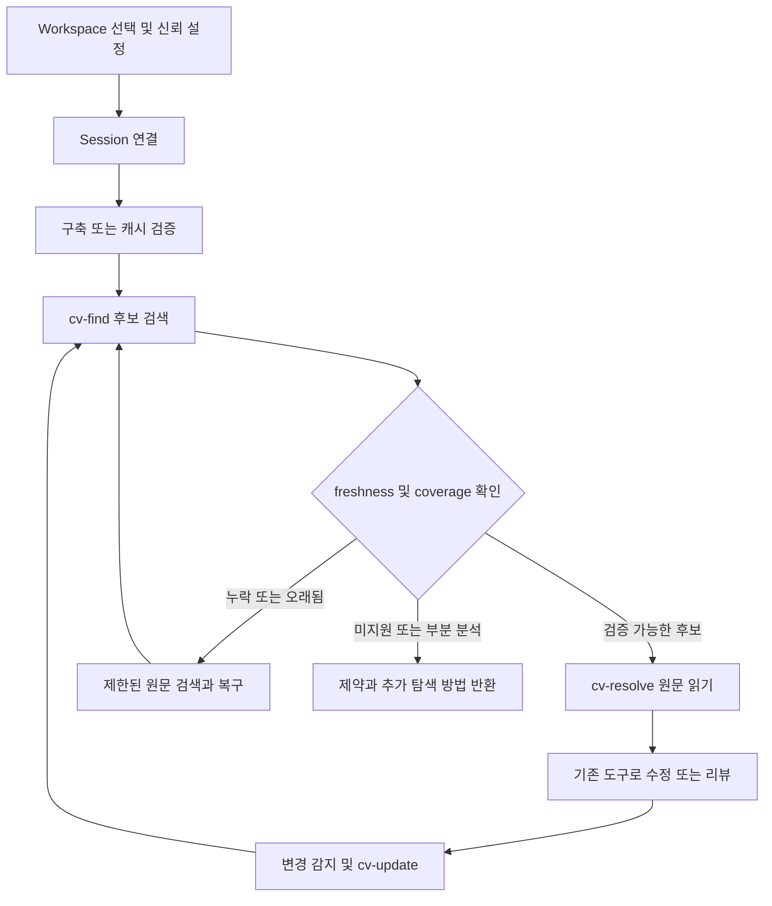

# Design

## 문서 상태와 읽는 순서

- 작성일: 2026-09-19.
- 분석 기준: `29374c6f969231d37937328005ee017c985f4d0f`의 `docs/ideas/` 전체 3개 문서.
- 상태: 구현 준비 초안. **이 문서의 추천안은 사용자 승인으로 간주하지 않는다.**
- 읽는 순서: 본 문서 → [architecture.md](architecture.md) → [user-confirm.md](user-confirm.md) → [plan.md](plan.md).
- 이번 산출물은 기획·설계·검증 계획이다. 엔진, 플러그인, 벤치마크 실행 결과는 아직 없다.

## Overview

Code-Virtualize는 코드베이스를 심볼 중심으로 탐색하고 필요한 원문 범위만 읽도록 돕는 독립 Code Context Engine이다. `.cv`는 재생성할 수 있는 탐색용 인덱스이며, 소스코드가 유일한 진실의 원천이다. Claude 연동은 엔진을 호출하는 첫 번째 클라이언트다.

원안의 핵심 가설은 탐색 토큰·읽기량 감소다. 검토 의견은 기존 도구 대비 정확도와 차별성 검증을 먼저 요구한다. 어느 쪽이 최종 제품 방향인지는 미확정이며 UC-001로 관리한다. **추천 경로는 기존 탐색 방식 측정 → 기존 도구 비교 → 필요할 때 C# PoC → 결과에 따라 후속 투자 결정**이다.

## 근거와 결정의 구분

| 출처 | 읽은 범위 | 설계에 반영한 내용 | 취급 |
|---|---|---|---|
| [아이디어 목록](../ideas/README.md) | 전체 | 위키에서 이관한 시점과 문서 역할 | 출처 정보 |
| [아이디어 원안](../ideas/code-virtualize.md) | 1~15절 전체 | 원본 우선, `.cv`, CLI, 독립 엔진, C# PoC, 벤치마크 | 명시 원칙과 제안을 구분 |
| [Claude 검토 의견](../ideas/code-virtualize-feedback-claude.md) | 전체 | 기존 도구 비교, 부분 누락, 캐시·동시성, freshness, VCS 기준점 | 검토자의 권고이며 사용자 확정 아님 |

원안 15절은 실제로 `benchmark task/g`에서 끝난다. 잘린 내용을 복원하거나 위키의 이후 내용을 원안에 섞지 않았다. 필요한 추가 입력은 UC-010에 기록한다.

| 주제 | 원안 | 검토 의견 | 현재 처리 |
|---|---|---|---|
| 가치·개발 순서 | 토큰 절감 엔진, C# Symbol PoC부터 | 측정 우선, 차별 기능 또는 얇은 연동 | UC-001, UC-002 |
| 캐시 | 세션 full build 후 폐기 | 영속 해시 캐시 + 세션 분리 | UC-004 |
| diff 기준점 | 세션 시작 snapshot | Git revision / Perforce CL 기준 | UC-005 |
| 심볼 깊이 | visibility별 점진 생성, L0~L3 | private 포함, L2/L3 보류 | UC-006 |
| runtime·배포 | npm launcher + 언어별 worker 검토 | PoC에 앞선 다중 runtime 지양 | UC-003 |

## Problem

1. 반복 검색·전체 파일 읽기는 관련 없는 코드를 컨텍스트에 넣을 수 있다. 실제 비중과 비용은 미측정이다.
2. 같은 이름의 심볼, overload, partial 선언을 문자열 검색만으로 구분하기 어렵다.
3. 오래된 인덱스는 잘못된 원문을 반환할 수 있고, 일부 참조만 반환하는 인덱스는 검증에 성공해도 영향 범위를 누락할 수 있다.
4. 기존 LSP·Serena와 기능이 겹친다. 별도 엔진이 필요한지는 비교 실험 전에는 알 수 없다.
5. 세션마다 구축하는 비용, 수정 추적, 여러 에이전트의 동시 접근이 절감 효과를 상쇄할 수 있다.

## Goals

- G-01: 탐색 비용과 품질을 재현 가능하게 비교하여 개발 투자 여부를 결정한다.
- G-02: 지원하는 C# 빌드 구성에서 결정적인 심볼 검색과 원문 resolve를 제공한다.
- G-03: stale·missing·partial·unsupported를 정상적인 완전 결과와 구분한다.
- G-04: index 실패 시 원문 탐색을 지속하고 복구 결과를 검증한다.
- G-05: 후속 단계에서 변경 심볼·영향 후보를 textual diff와 함께 제시한다.

## Non-Goals

- 이번 준비 작업에서 제품 코드, 플러그인 설치, 실제 세션 로그 수집, 유료 모델 실험을 수행하지 않는다.
- 초기 PoC에 C++/UE5, Blueprint·리플렉션 완전 분석, Perforce 운영 연동을 모두 넣지 않는다. 이 범위는 UC-002 대상이다.
- 인덱스만 보고 안전한 rename·수정·리뷰 완료를 선언하지 않는다. 소스 편집은 에이전트의 기존 도구가 담당한다.
- LLM/embedding 기반 관련도 점수, L3 expression 인덱스, 클라우드 인덱스 동기화를 초기 필수 기능으로 넣지 않는다.
- 웹 대시보드·데스크톱 앱·시각적 그래프 편집기를 제품 요구로 추가하지 않는다.

## Target Users

| 사용자 | 해야 하는 일 | 성공의 증거 |
|---|---|---|
| C# 프로젝트를 탐색하는 개발자·에이전트 | 정확한 선언과 필요한 문맥 찾기 | 올바른 선언·원문 범위와 빌드 구성 식별 |
| 엔진·하네스 유지관리자 | 인덱스 상태, 비용, 누락 원인 진단 | `cv-inspect`와 구조화된 로컬 이벤트 |
| 변경 검토자 | 수정 심볼과 영향 후보 파악 | 실제 diff와 증거를 확인한 결함 탐지 |
| 이후 UE5/Perforce 사용자 | 매크로·CL 기반 탐색과 리뷰 | 별도 corpus에서 확인할 후속 가설 |

## Core Concept

`질문 → 후보 심볼 → 식별자·상태 확인 → 검증된 원문 → 기존 편집/리뷰` 흐름을 제공한다. 인덱스 유효성(freshness), 분석 범위(coverage), 결과 잘림(truncation)은 별개다. 파일 해시가 맞는다고 전체 참조를 찾았다는 뜻은 아니다.

LSP는 definition/reference/workspace symbol 관련 표준 기능을 제공하고, Serena는 LSP 기반 심볼 검색과 참조 탐색을 제공한다. 따라서 같은 이름의 기능을 보유했다는 사실만으로 차별성을 주장하지 않는다. [LSP 명세](https://microsoft.github.io/language-server-protocol/specifications/lsp/3.17/specification/), [Serena 공식 저장소](https://github.com/oraios/serena).

CV의 추가 가치는 **검증된 증분 캐시, 명시적인 coverage 계약, revision 기준 심볼 변화와 리뷰 증거 연결**에서 검증할 후보 가설이다. 기존 도구가 이를 충분히 해결하면 얇은 연동만 만들거나 개발을 중단할 수 있다.

## User Scenarios

### S-01 — 동일 이름의 메서드 탐색

에이전트가 `Load`를 검색한다. 엔진은 프로젝트·타입·매개변수·선언 위치를 포함한 후보를 정렬해 반환한다. 후보가 여러 개면 첫 항목을 임의 선택하지 않는다. 에이전트가 `symbolId`와 snapshot을 선택한 후 원문을 읽는다.

### S-02 — IDE에서 동시에 편집

사람이 도구 훅을 거치지 않고 파일을 바꾼다. resolve는 저장된 span을 바로 읽지 않고 원문 bytes와 fingerprint를 확인한다. 불일치 시 이전 줄 범위를 반환하지 않고 재파싱 또는 원문 fallback을 수행한다. 연속 편집으로 재시도 한도를 넘으면 명확하게 실패한다.

### S-03 — 불완전한 영향 분석

정적 참조와 이름 기반 검색 후보를 서로 다른 목록으로 보여준다. DI 문자열·리플렉션·XAML·생성 코드의 누락 가능성을 설명한다. `0 references`를 `no impact`로 해석하지 않는다. 후보는 직접 참조, 추정 후보, 미분석 범위로 구분한다.

### S-04 — 이미 수정된 작업 공간의 리뷰

사용자가 base revision과 target을 명시한다. 세션 시작 이전 변경도 textual diff에 들어간다. 삭제된 심볼은 base 원문에서 읽는다. base가 없으면 추측하지 않고 `BASE_REQUIRED`를 반환한다. 세션 diff는 선택한 경우에만 별도의 의미로 제공한다.

### S-05 — 두 세션이 동시에 사용

같은 workspace의 두 에이전트는 다른 session ID를 갖는다. 읽기는 하나의 완성된 generation을 고정하며, update 도중 일부만 쓰인 파일을 읽지 않는다. 한 세션 종료가 다른 세션의 데이터를 지우지 않는다.

## User Flow

## Features

| 단계 | 기능 | 진입 조건 |
|---|---|---|
| 조사 | 세션 탐색 비중, 범위 읽기·LSP·Serena 비교, 정답 corpus | UC-007 데이터·예산 범위 승인 후 실제 실행 |
| C# PoC 후보 | `cv-build`, `cv-find`, `cv-resolve`, `cv-inspect`, `cv-validate` | UC-001~004, UC-006, UC-008 결정 및 비교 결과 |
| 안정화 후보 | `cv-update`, 동시성·failure injection·구조화 metrics | PoC 계약과 데이터 수명 확정 |
| 참조·리뷰 후보 | remark lazy resolve, `cv-impact`, `cv-diff`, Claude 연동 | UC-005, UC-009 및 단계별 결과 |
| 후속 | Perforce, C++/UE5, Codex 연동, npm 배포, GUI | UC-002, UC-003, UC-011의 별도 승인 |

## Functional Requirements

| ID | 요구사항 | 수용 조건 |
|---|---|---|
| FR-01 | 명시한 workspace·project·구성만 분석 | 범위 밖 경로 거부, 미로드 프로젝트 별도 집계 |
| FR-02 | 선언 검색과 식별자 반환 | overload·generic arity·partial·동명 프로젝트를 구분 |
| FR-03 | 원문 lazy resolve | snapshot과 같은 bytes에서 span 계산·내용 추출, UTF-16 및 줄 번호 계약 준수 |
| FR-04 | freshness 검증 | 같은 mtime·크기의 내용 변경도 digest 검증으로 탐지 |
| FR-05 | fallback·repair | 한정된 재시도, 원인·실제 수행 여부·복구 상태를 반환 |
| FR-06 | coverage 전달 | analyzed/excluded/failed/unknown/truncated를 응답에 유지 |
| FR-07 | 변경 적용 | 추가·수정·삭제·rename·프로젝트 설정 변경을 구분하고 semantic 의존성 무효화 |
| FR-08 | 동시 접근 | generation 단위 읽기, 단일 writer, 세션별 기준점 보존 |
| FR-09 | 진단·metrics | 원문을 기본 로그에 남기지 않고 비용·상태·오류 코드 기록 |
| FR-10 | 영향 후보 | 정적 참조와 텍스트 후보 분리, 동적 참조 완전성 미보장 |
| FR-11 | 변경 비교 | 명시 base/target, 추가·삭제·본문·signature 변화, textual diff 연결 |
| FR-12 | 연동 | 도구 장애가 기존 검색·원문 읽기를 막지 않으며 훅을 freshness의 유일한 근거로 삼지 않음 |
| FR-13 | 주석 lazy resolve | 현재 source에서 주석·XML 문서를 읽고 원문 위치·fingerprint 제공 |

## Non-Functional Requirements

- 결정성: 같은 source snapshot·config·query·schema이면 정렬과 ID 생성이 동일하다. 시각·request ID는 예외다.
- 성능: cold/warm/long 세션을 분리하고 build/update/fallback을 총시간에 포함한다. 목표 숫자는 UC-007 승인 전 고정하지 않는다.
- 견고성: 잘못된 schema·부분 write·worker crash·파일 잠금에서 기존 generation을 보존한다.
- 관측성: 결과 없음, 부분 결과, 내부 오류, 미지원 상태를 구분하고 기계가 처리할 수 있어야 한다.
- 보안: 로컬 읽기 중심, workspace 경계 준수, 원문·시크릿의 자동 외부 전송 없음. 빌드·generator 실행 신뢰 정책은 UC-008.
- 호환성: Windows·PowerShell 사용 환경을 우선 검증한다. 지원 OS와 SDK 버전은 UC-002/003 이후 고정한다.

## Constraints

현재 저장소에는 아이디어 문서만 있다. `.sln`, package manifest, 제품 테스트, 고정 runtime 버전은 없다. 준비 문서의 directory 구조와 명령은 제안 계약이며 설치 가능한 제품 명령이 아니다.

원안의 `.cv` 확장자·독립 엔진·CLI `cv-*` 접두사·원본 우선 원칙은 보존한다. 저장 방식, 출력 스키마, 자동화 범위, retention, 지원 깊이는 아직 확정되지 않았다.

## Edge Cases

| 상황 | 기대 동작 |
|---|---|
| 솔루션 없음·빈 workspace | 지원 범위와 빈 결과 원인을 구분; 자동으로 전체 디스크 탐색하지 않음 |
| 복수 target framework·전처리 기호 | 분석한 구성 명시; 다른 구성까지 완전하다고 표시하지 않음 |
| partial·linked file·generated source | 선언 위치 목록 유지; 가상 document는 실제 파일 경로처럼 취급하지 않음 |
| reflection·DI·XAML 참조 | 동적 누락 위험 유지; 텍스트 후보와 확인된 참조 분리 |
| 결과 page 제한 | continuation과 truncated 표시; 다음 페이지에서 generation 변경 시 재검색 요구 |
| 취소·timeout·디스크 부족 | publish 중단, 기존 generation 보존, 자원 정리 |
| newline·한글·emoji·BOM | 원문 인코딩 유지, offset 단위 명확화, 변형 없는 범위 읽기 |
| branch switch·sync·설정 변경 | 파일 변경 외에 project graph·reference fingerprint 무효화 |
| 삭제·이동·공백 포함 파일명 | base/current 역할 구분, shell 문자열 결합 없이 인자 전달 |

## UI 필요 여부

기존 문서는 CLI, 에이전트 도구, 사람이 보는 `cv-inspect`만 요구한다. `cv-inspect`는 구조화 JSON과 비대화형 터미널 표로 목적을 충족할 수 있다. 현재 준비 범위에서 그래픽 UI가 필수라는 근거는 없다.

따라서 스킬의 UI 생략 조건을 적용하여 `samples/` 3종은 생성하지 않는다. 터미널 출력은 [architecture.md](architecture.md)의 Interfaces에 예시를 제공한다. GUI로 확장할 경우 UC-011 결정 후 `impeccable`·`design-taste-frontend`를 사용하여 정보 구조가 다른 시안 3종을 먼저 만든다.

## Success Criteria

### 준비 완료

모든 아이디어를 추적할 수 있고, 충돌은 UC로 연결되며, 각 구현 작업에 산출물·검증·Agent·Model·Reasoning Level·Blocked By가 존재한다. 사용자 승인 전에도 실행 가능한 조사 준비 작업과 승인 후 작업이 구분되어야 한다.

### 제품 진행 판단

1. 품질 보존: 독립 정답·build/test·리뷰 판정으로 평가한다. 모델 자기평가는 주 판정 근거가 아니다.
2. 순효율: 캐시 요금·도구 정의 토큰·구축·복구 비용을 포함한다.
3. 규모별 가치: small/medium/large의 크기·symbol·graph 지표를 기록한다.
4. 복구 안전성: stale source를 검증된 결과로 반환하는 사례와 조용한 부분 결과를 failure injection으로 찾는다.
5. 반복성: task·repository별 편차와 비교군의 실제 도구 사용률을 공개한다.

원안의 `-42%`, `94% → 95%`, `1.8s`는 예시이며 실제 결과·목표치로 재사용하지 않는다. 표본·허용 품질 저하·효율 최소 차이·예산·Go/No-Go 기준은 UC-007에서 사전 확정한다.
