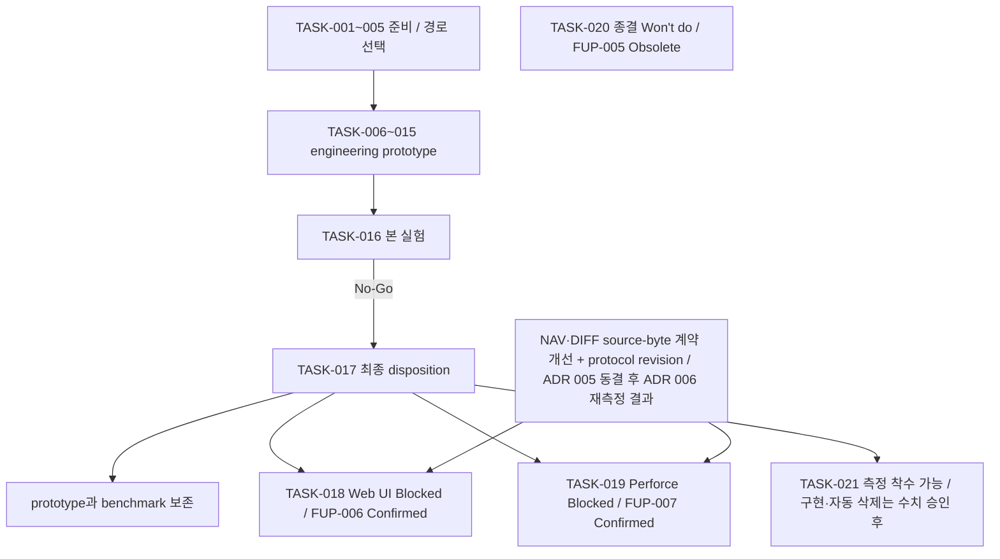
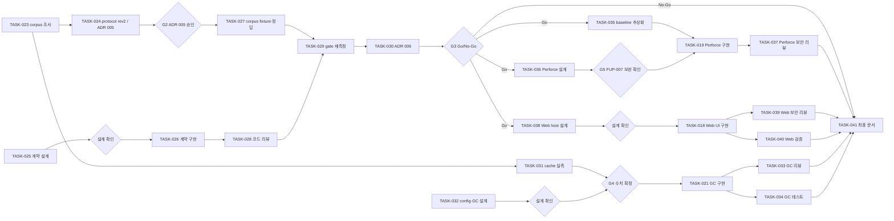

# Implementation Plan

## 기준과 현재 상태

작성일: 2026-09-20. 모델 배정과 서브에이전트 실행 방식 갱신: 2026-09-20. [design.md](design.md), [architecture.md](architecture.md), [user-confirm.md](user-confirm.md)의 확정 결정과 [UI 시안 3종](samples/index.html)을 종합했다. 기준은 사용자 인터뷰 커밋 `b16df53`, [ADR 001](../decisions/001-product-path.md), [ADR 002](../decisions/002-validation-outcome.md), [ADR 003](../decisions/003-next-step.md)이다. TASK-001~016 구현·검증과 TASK-017의 최종 No-Go 후속 결정을 반영했다. 2026-09-21/22에 FUP-004~007 확정 사항과 TASK-018~021 상태를 [user-confirm.md](user-confirm.md)·[user-confirm2.md](user-confirm2.md) 기준으로 동기화했다. 2026-09-23에 재개 경로(G1)를 확정하고 TASK-022~041 후속 실행 계획과 Claude 역할·모델 배정을 추가했다.

- UC-001~011은 모두 Confirmed다. 다시 선택을 요구하지 않는다.
- TASK-006~016의 Windows/C#/Git 기술 prototype, Core·CLI·MCP·Claude adapter와 benchmark artifact는 보존한다.
- TASK-016에서 E 품질 `6/6`, recall `27/27`, Critical `0`을 확인했지만 source bytes가 NAV `9.75% 감소`, DIFF `1,618.9% 증가`로 동결된 `20% 이상 감소` gate에 실패했다.
- 실제 model token 효율은 `inconclusive`이며 source bytes/lines와 분리한다. C/D는 unavailable이다.
- 제품화 자동 진행은 중단한다. 로컬 Web UI와 Perforce 요구는 폐기하지 않고 재개 조건부 `Blocked`로 보존한다.
- 자동 GC는 FUP-004 확정 정책(`age`/`capacity`/`hybrid` 중 config 선택, 활성 generation 보호, dry-run)을 따르며 기본값은 `gc.enabled = false`다. 삭제 없는 측정·정책 제안은 TASK-021에서 착수할 수 있고 retention·용량 수치를 실측·승인받기 전에는 자동 삭제를 켜지 않는다. 잘린 원문 복구 요구는 FUP-005로 폐기했고 TASK-020은 종결(Won't do)이다.

## 실행 상태와 gate

`Complete`는 산출물과 검증이 끝난 작업, `Ready`는 현재 실행 가능한 작업, `Blocked`는 외부 입력·새 결정이 필요한 작업이다. TASK-001~017은 완료됐다. TASK-018·019는 아래 재개 조건이 남은 `Blocked` 상태이고, TASK-020은 종결(Won't do), TASK-021은 삭제 없는 측정·정책 제안까지는 착수 가능하며 GC 구현과 자동 삭제 활성화는 수치 확정 후로 `Blocked`다. TASK-022~025·032는 완료됐고 TASK-026·042가 진행 중이며 TASK-027·031이 `Ready`다. 세부 순서는 아래 후속 실행 계획을 따른다.

| Gate | 결과·조건 | 영향 |
|---|---|---|
| Pilot 실행 | 합성 smoke 완료; 실제 로그·model token/비용은 FUP-001 미완 | TASK-004 합성 범위 Complete |
| Prototype 구현 | 별도 전체 구현 지시로 TASK-006~015 완료 | 기술 artifact 보존; 제품 가치 Go 주장 금지 |
| 본 실험 | 품질 6/6·recall 27/27·Critical 0, source-byte 20% gate 실패, token inconclusive, C/D unavailable | TASK-016 Complete — No-Go |
| 후속 결정 | 기술 prototype 보존, 독립 엔진 제품화 자동 진행 중단 | TASK-017 Complete |
| UI 제품화 | FUP-006 Confirmed(Sample 1 + Blazor Server); 공통 재개 증거·새 ADR 필요 | TASK-018 Blocked |
| 필수 Perforce | FUP-007 Confirmed/Environment Unavailable(계약 확정, 실환경 미제공); 공통 재개 증거·새 ADR 필요 | TASK-019 Blocked |
| 원문 복구 | FUP-005 Obsolete — 복구 요구 폐기 | TASK-020 종결 (Won't do) |
| 자동 GC | FUP-004 Confirmed(정책 확정); retention·용량 수치는 실측 후 확정, 승인 전 no-delete | TASK-021 측정 착수 가능 |

TASK-001/002/003은 독립적인 준비 작업이었다. 완료된 prototype과 재현 artifact는 보존한다. 원문 복구가 전체 작업의 불필요한 선행 조건이 되지 않게 하며, No-Go 후속 제품 작업은 새 증거·입력·결정을 갖추기 전 실행하지 않는다.

## 후속 실행 계획 (TASK-022~041)

2026-09-23 사용자가 재개 경로(G1)를 "NAV·DIFF source-byte 계약 개선 + medium/large 공개 C# corpus protocol revision"으로 확정했다. 현재 계상 방식에서 small 합성 corpus의 DIFF task는 gate를 통과할 수 없다. DIFF-03의 필수 반환 슬라이스(74 B)가 20% 통과선(59.2 B)보다 크기 때문이다. 다만 이 통과선은 baseline B가 품질 판정에 쓴 `git diff` 출력(원문 줄 402 B)을 source bytes에 넣지 않은 비대칭 계상에서 나온 값이다(`benchmarks/runs/CvEvaluationRunner.cs:246-265`, 2026-09-23 확인). 계상 규칙은 TASK-024(ADR 005)에서 결과를 보기 전에 확정한다. 어느 쪽이든 small corpus만으로는 제품 가치를 판단할 수 없으므로 protocol revision이 함께 필요하다.

| Phase | TASK | 목적 | 착수 조건 |
|---|---|---|---|
| 0 정리 | TASK-022 | FUP 확정 상태 문서 동기화 | Complete |
| 1 재개 gate | TASK-023~030 | 계약 개선, protocol revision, 재측정, ADR 005·006 | TASK-023·025 Ready |
| 2 cache 정책 | TASK-031~034, TASK-021 | 실측 → 수치 확정 → GC 구현·검증 | TASK-032 Ready, TASK-031은 TASK-023 후 |
| 3 제품화 | TASK-035~040, TASK-018·019 | Perforce(합성 fixture 범위)와 Web UI | G3 Go일 때만 |
| 4 마무리 | TASK-041 | 최종 문서·위키 | 앞 단계 완료 |

Phase 2는 ADR 003 조건 6에 따라 공통 재개 조건 없이 진행하며 메인 트랙 결과와 무관하다. 실측은 TASK-023에서 고른 공개 corpus로 해서 수치를 공개 레포에 기록할 수 있게 한다.

### 사용자 확인 gate

| Gate | 내용 | 뒤따르는 작업 |
|---|---|---|
| G1 | 재개 경로 확정 — 2026-09-23 확정 | Phase 1 |
| G2 | ADR 005 승인 (새 corpus 결과 전 protocol 동결) | TASK-027, TASK-029 |
| G3 | ADR 006 판정 — Go면 Phase 3, No-Go면 prototype 보존으로 종료 | Phase 3 |
| G4 | retention·용량 수치 확정 | TASK-021 |
| G5 | FUP-007 보완안(인증·charset·실패 계약·마스킹) 확인 | TASK-019 |
| 설계 확인 | TASK-025, TASK-032, TASK-038의 설계 | TASK-026, TASK-021, TASK-018 |

커밋·push·PR은 사용자 승인 범위에서 메인 에이전트가 처리한다.

### 의존 관계

### 운영 규칙

- 구현 TASK(026, 021, 019, 018)는 작업별 브랜치와 격리된 worktree에서 진행한다. TASK-026과 TASK-021은 모두 CLI 진입점(`src/CodeVirtualize.Cli/Program.cs`)을 수정하므로 PR을 순서대로 병합한다.
- TASK-026 담당에게 TASK-027의 새 corpus 정답을 제공하지 않는다. 측정 대상에 맞춘 계약 튜닝을 막기 위해서다.
- TASK-027 정답은 CV 또는 동일 query의 출력으로 만들지 않는다.
- 리뷰·검증 TASK에서 Critical·High가 나오면 해결되거나 사용자가 수용하기 전까지 다음 TASK로 넘어가지 않는다. TASK-028·033은 교차 리뷰 원칙에 따라 Codex 리뷰를 병행할 수 있다.

## Agent / Model 배정

계획의 모든 TASK는 표에 지정한 모델과 추론 수준을 명시한 Codex 서브에이전트에 배정한다. 사용 모델은 `gpt-5.6-sol`, `gpt-5.6-terra`, `gpt-5.6-luna`다. 복합 설계·검토·통합 판단은 Sol High, 명확한 구현·분석은 Sol/Terra Medium 또는 High, 제한된 출처 수집은 Luna Low다. 기존 상위 모델 배정은 검증 범위를 유지한 채 Sol High로 통일했다. 불필요하게 높은 추론 수준을 쓰지 않는다.

전역 역할 규칙의 Claude 설계·교차 리뷰 선호는 유지한다. 이 세션에서 특정 Claude 모델의 실행 가능성이 확인되지 않았으므로 계획에 호출 불가능한 모델명을 기입하지 않았다. 실제 Claude 환경을 확인하면 해당 작업을 동등 역할로 재배정하고 모델·추론 수준을 갱신한다. 모델 배정은 계획이며 유료 agent 실행 권한·실험 예산의 대체물이 아니다.

2026-09-23부터 TASK-018 이후의 미완료 TASK는 station 허브의 Claude 역할 정의(`.claude/agents/`)로 배정하고 **모델만 지정**한다. 추론 수준은 지정하지 않으며 실행 환경의 기본값을 따른다. `opus`는 설계·측정 판정·리뷰처럼 틀리면 되돌리는 비용이 큰 판단, `sonnet`은 확정된 설계의 구현·테스트·조사·문서에 배정한다. 순수 기계적 반복 작업이 없어 `haiku`는 배정하지 않았다. TASK-001~017과 종결된 TASK-020의 Codex 배정은 실행 기록으로 보존한다.

## 서브에이전트 실행 방식

- 메인 에이전트는 dispatcher와 integrator 역할을 맡는다. TASK의 `Dependencies`, `Blocked By`, `Status`를 확인하고 실행 가능한 TASK만 서브에이전트에 전달한다.
- TASK 하나를 기본 작업 단위로 사용한다. 서브에이전트 프롬프트에는 Goal, Dependencies, Scope, Files, Validation, 확정된 UC/FUP 입력, 브랜치와 금지 범위를 포함한다.
- 각 서브에이전트 호출에는 TASK 표의 `Model`과 `Reasoning Level`을 명시한다. 모델을 상속에 맡기거나 실행 중 임의로 낮추지 않는다. TASK-018 이후는 `Model`만 명시한다.
- 의존성이 없고 파일·외부 상태를 공유하지 않는 TASK만 병렬 실행한다. TASK-001/002/003처럼 독립적인 준비 작업은 함께 실행할 수 있다. 같은 schema·브랜치·실험 데이터·생성 파일을 수정하는 TASK는 순차 실행하거나 격리된 worktree를 사용한다.
- 서브에이전트는 자신의 TASK 산출물과 검증 결과를 반환한다. 메인 에이전트가 diff, 요구사항 추적, 테스트, 보안 경계와 다음 TASK의 준비 상태를 직접 확인한 뒤 통합한다.
- `Blocked`와 아직 gate를 통과하지 않은 `Conditional` TASK는 스폰하지 않는다. 필요한 FUP 입력이나 Go/No-Go 결정이 확보되면 문서 상태를 먼저 갱신한다.
- 서브에이전트는 커밋·push·PR·병합을 수행하지 않는다. 통합 검증이 끝난 뒤 메인 에이전트가 사용자 승인 범위에서 Git 작업을 처리한다.

## 실험 프로토콜

### 조건과 통제

| 조건 | 구성 | 목적 |
|---|---|---|
| A | 기존 grep/search/read | baseline |
| B | A + 필요한 범위만 읽는 고정 지침 | 지시문 효과 분리 |
| C | 같은 하네스 + 사용 가능한 C# LSP | 표준 semantic 탐색 |
| D | 같은 하네스 + Serena | 기존 agent 도구 |
| E | 같은 하네스 + CV, 구현·정확성 gate 이후 | CV 추가 가치 |

repo/commit, task prompt, 모델 version/reasoning, 원본 접근 권한, timeout을 고정한다. 조건별 도구 정의·지침의 차이와 token 비용을 기록한다. 같은 작업의 조건 순서를 seed로 무작위화 또는 균형 교차하며 깨끗한 worktree·새 agent context를 사용한다. 실패·timeout·CV 미사용 실행도 전체 결과에서 제외하지 않는다. 설치 불가 비교군은 unavailable로 표시하고 0 비용/0 결과로 대체하지 않는다.

### Corpus와 정답

small/medium/large를 LOC뿐 아니라 file/symbol/project/reference 수로 정의한다. 초기 navigation·understanding·bug fix·feature change, 후속 impact/refactoring/review·stale/missing을 capability에 맞춰 평가한다. 공개 repo는 commit·license·대표성·학습 노출 가능성을 기록하고 UE5/개인 프로젝트를 대표한다고 단정하지 않는다.

합성 source fixture에서 선언·호출·동적 후보의 정답을 직접 검토한다. static과 dynamic ground truth를 분리하고 CV 또는 동일 query의 출력을 자체 정답으로 사용하지 않는다. tuning task와 held-out task를 분리하며 판정 후 데이터를 변경하면 새 실험으로 기록한다.

### Pilot와 본 실험의 구분

UC-007에 따라 TASK-001이 프로토콜을 고정하고 TASK-004에서 합성 fixture 전용 smoke를 실행했다. A/B는 품질을 통과했고 C/D는 unavailable이었으며 token·비용은 미측정이다. 실제 승인 로그·실제 모델 token/비용 평가는 FUP-001의 미완 범위이며 합성 결과로 대체하지 않는다.

본 실험 기준은 FUP-002와 ADR 001에 동결했다: 품질 저하 0, stale/조용한 partial Critical 0, task·조건별 최소 3회, seed `20260920`, stronger available baseline 대비 source bytes 또는 실제 input token 20% 이상 감소, cold/warm/update 60/2/5초, peak working set 1 GiB, 외부 유료비용 0, 전체 30분이다. token이 미측정이면 token 이득은 `inconclusive`다.

### 측정과 판정

- cold는 index/worker startup 포함, warm은 실제 구축 후 탐색(준비 비용 별도), long은 여러 task/edit·update를 누적 측정한다.
- input/output·cache read/write token, 최대 context, source bytes/lines, 도구 호출/실제 CV 사용률, fallback/repair, build/update/wall time, peak memory를 기록한다.
- provider token 분류의 중복 여부를 확인하고 측정일 가격표로 비용을 계산한다. cache token을 input에 이중 합산하지 않는다. usage가 없으면 추정/미측정이며 line 수를 실제 token으로 부르지 않는다.
- build/test·정답 위치·독립 리뷰로 성공과 defect recall/false positive를 판정한다. 모델 자기평가는 주 기준이 아니다.
- task별 paired 차이, 중앙값/p95/분산, 품질 차이의 불확실성 구간을 보고한다. 적은 반복 pilot이 충분한 통계 검증이라는 주장을 하지 않는다.
- TokenSaving = (A_input - E_input) / A_input. baseline 0이면 정의하지 않는다.
- ReferenceRecall = 정답과 일치하는 참조 수 / 정답 참조 수. 정답 0건을 100%로 채우지 않는다.
- ResolveAccuracy = 정확히 resolve한 범위 / 시도 수. unsupported·명시 실패도 별도 집계한다.
- 승인된 품질 비열등 기준과 최소 효율 차이를 함께 판단한다. E는 A뿐 아니라 사전 규칙으로 정한 강한 비교군 B/C/D와 비교한다.
- break-even은 같은 sequence의 누적 비용 차이가 이득으로 바뀌어 유지되는 첫 task다. 관측되지 않으면 not reached다.
- token·초·bytes를 임의로 더한 단일 점수로 손해를 숨기지 않는다. stale 원문 오반환·조용한 부분 결과는 평균 절감으로 상쇄하지 않는다.
- 원문/시크릿/전체 세션 로그는 로컬 비공개로 관리한다. 보고·commit에는 승인된 비식별 집계만 포함한다. 이번 prepare에서 실제 로그 분석이나 유료 실험은 실행하지 않았다.

## TASK-001 — pilot 프로토콜과 로그 집계 계약

### Goal
실제 로그를 읽기 전에 비교 조건·측정 분모·집계 형식을 정의한다.

### Dependencies
없음

### Scope
Read/Grep 비중·전체 읽기율·재읽기율·주석 비율, cache-aware 비용, pilot 범위·예산 후보와 비식별화 규칙을 작성한다. 원문 복원으로 표시하지 않는다.

### Files
`benchmarks/protocol.md` / `benchmarks/result.schema.json` / `benchmarks/log-analysis.md`

### Validation
합성 이벤트로 분모·중복 token·누락 필드·실패 실행 집계를 손으로 검산한다.

| 배정 | 값 |
|---|---|
| Agent | Codex subagent |
| Model | gpt-5.6-sol |
| Reasoning Level | Medium |
| Reason | 측정 계약과 집계의 오류를 검토하면서 작은 산출물로 나눈다. |

### Blocked By
없음

### Status
Complete — 2026-09-20

## TASK-002 — 독립 정답 fixture와 corpus 후보

### Goal
CV 결과에 의존하지 않는 C# 선언·참조·diff 정답을 준비한다.

### Dependencies
없음; TASK-001과 병렬 가능

### Scope
overload/generic/partial/private/linked file·동적 참조·CRLF/emoji, VCS/session dirty-start·삭제 snapshot fixture를 만든다. 공개 repo는 후보와 commit/license만 조사한다.

### Files
`tests/fixtures/csharp/` / `benchmarks/tasks/` / `benchmarks/corpus-candidates.md`

### Validation
source와 정답 위치를 독립 대조한다. CV 또는 같은 Roslyn query를 정답 생성기로 사용하지 않는다.

| 배정 | 값 |
|---|---|
| Agent | Codex subagent |
| Model | gpt-5.6-terra |
| Reasoning Level | Medium |
| Reason | 기준이 명확한 테스트 자료 제작이다. |

### Blocked By
없음; 실제 corpus 실행은 FUP-001

### Status
Complete — 2026-09-20

## TASK-003 — 기존 도구 capability 조사

### Goal
LSP·Serena·범위 읽기와 CV의 중복·차별 가설을 확인한다.

### Dependencies
없음

### Scope
공식 문서의 지원 기능·runtime·버전·호출 방법·제약을 정리한다. 문서에 기능이 있다는 사실을 실측 성능으로 바꾸지 않는다.

### Files
`benchmarks/tool-matrix.md`

### Validation
각 claim에 공식 출처·확인일·버전/미확인 표시가 있는지 검토한다.

| 배정 | 값 |
|---|---|
| Agent | Codex subagent |
| Model | gpt-5.6-luna |
| Reasoning Level | Low |
| Reason | 한정된 기능 목록과 출처 수집이다. |

### Blocked By
없음; 실제 설치·모델 실행 제외

### Status
Complete — 2026-09-20

## TASK-004 — 승인된 데이터로 pilot 실행

### Goal
현재 탐색 비용과 기존 도구 효과의 분포를 측정한다.

### Dependencies
TASK-001, TASK-002, TASK-003

### Scope
지정 로그 경로·기간만 집계하고 고정 corpus에서 A/B/C/D pilot을 수행한다. 모델·권한·시작 상태·조건 순서를 통제한다. 예산 초과 시 중단하며 원시 로그를 공개하지 않는다.

### Files
`benchmarks/runs/ (로컬 비공개)` / `benchmarks/results/pilot-report.md` / `비식별 run manifest`

### Validation
원시 usage와 집계 대조, 실패 포함 denominator, 실제 도구 사용률·비용 상한을 확인한다. pilot을 확정적 가치 증명이라고 보고하지 않는다.

| 배정 | 값 |
|---|---|
| Agent | Codex subagent |
| Model | gpt-5.6-sol |
| Reasoning Level | High |
| Reason | 실험 조건·개인정보·비용 집계를 함께 통제한다. |

### Blocked By
없음 — 합성 smoke 완료; 실제 승인 로그·모델 token/비용 평가는 FUP-001 미완
### Status
Complete — 2026-09-20 (합성 smoke 범위)

## TASK-005 — Go/No-Go와 본 실험 기준 확정

### Goal
pilot 결과를 사용자와 검토해 엔진/얇은 연동/중단 경로를 선택한다.

### Dependencies
TASK-004

### Scope
불확실성·유지보수·기존 도구 우위를 검토하고 최종 품질/효율 기준과 본 실험 예산을 기록한다. 엔진 선택 시 승인된 .NET 설계를 적용한다. 누락 원문 요구는 끼워 넣지 않는다.

### Files
`docs/decisions/001-product-path.md` / `docs/prepare/design.md` / `docs/prepare/architecture.md` / `docs/prepare/user-confirm.md` / `docs/prepare/plan.md`

### Validation
사용자 선택·근거·날짜를 기록하고 기준을 본 실험 전에 동결한다. 기존 도구 경로에서도 Web UI·필수 Perforce 요구의 처리 방법이 남아 있어야 한다.

| 배정 | 값 |
|---|---|
| Agent | Codex subagent |
| Model | gpt-5.6-sol |
| Reasoning Level | High |
| Reason | 제품 가치와 실험 불확실성을 통합하는 판단이다. |

### Blocked By
없음 — FUP-002/003 완료
### Status
Complete — 2026-09-20

## TASK-006 — .NET solution과 trust 경계

### Goal
Windows/C# Core·CLI·adapter의 빌드 가능한 기반을 만든다.

### Dependencies
TASK-005에서 독립 엔진 선택

### Scope
지원 SDK·package 버전을 고정하고 Core/CSharp/CLI/test 프로젝트와 CI를 만든다. .code-virtualize와 raw benchmark 데이터를 ignore한다. syntax-only 기본과 명시 trust 경계를 둔다.

### Files
`CodeVirtualize.sln` / `global.json` / `Directory.Build.props` / `.gitignore` / `src/` / `tests/` / `.github/workflows/ci.yml`

### Validation
restore/build/test와 CLI help를 실행한다. trust 없는 프로젝트의 generator·build sentinel이 실행되지 않아야 한다.

| 배정 | 값 |
|---|---|
| Agent | Codex subagent |
| Model | gpt-5.6-terra |
| Reasoning Level | Medium |
| Reason | 확정한 단일 runtime 구조의 정형 구현이다. |

### Blocked By
없음 — FUP-003 완료
### Status
Complete — 2026-09-20

## TASK-007 — .cv schema와 CLI 응답 계약

### Goal
ID·span·coverage·오류·paging·baseline 의미를 고정한다.

### Dependencies
TASK-006, TASK-002

### Scope
Manifest/Symbol/Declaration/Reference/Diff/Response schema, UTF-16 span·1-based line, partial/generic ID, generation cursor와 source 반환 예산을 정의한다.

### Files
`schemas/` / `src/CodeVirtualize.Core/Contracts/` / `tests/Core.Tests/Contracts/` / `docs/contracts/cli.md`

### Validation
round-trip·unknown schema 거부, not_found/partial/truncated/error 필드, cursor 세대 불일치, 두 baseline 직렬화를 검증한다.

| 배정 | 값 |
|---|---|
| Agent | Codex subagent |
| Model | gpt-5.6-sol |
| Reasoning Level | High |
| Reason | 모든 후속 작업에 영향을 미치는 계약 정합성을 결정한다. |

### Blocked By
없음; 선행 제품 경로 gate 적용

### Status
Complete — 2026-09-20

## TASK-008 — Immutable generation store

### Goal
부분 쓰기를 노출하지 않는 영속 store를 구현한다.

### Dependencies
TASK-007

### Scope
JSON manifest/JSONL shards, digest·schema·크기 검증, 임시 generation publish, reader pin·writer lock, semantic config fingerprint를 구현한다. 자동 파괴적 GC는 비활성 상태다.

### Files
`src/CodeVirtualize.Core/Storage/` / `tests/Core.Tests/Storage/` / `tests/Integration.Tests/Storage/`

### Validation
손상 shard·partial write·publish crash·disk full에서 이전 generation 유지 또는 명시 오류를 확인한다.

| 배정 | 값 |
|---|---|
| Agent | Codex subagent |
| Model | gpt-5.6-sol |
| Reasoning Level | High |
| Reason | 원자적 발행·복구의 오류는 데이터 정확성에 직접 영향을 준다. |

### Blocked By
없음; 자동 GC 수치는 FUP-004로 별도

### Status
Complete — 2026-09-20

## TASK-009 — C# 구축·검색

### Goal
cv-build/cv-find로 L0/L1 전체 접근성의 선언을 탐색한다.

### Dependencies
TASK-008

### Scope
Roslyn syntax/semantic 경로, partial 선언 병합, overload/generic ID, inventory·project coverage·제외 구성, 결정적 정렬·filter·paging을 구현한다.

### Files
`src/CodeVirtualize.CSharp/` / `src/CodeVirtualize.Core/Search/` / `src/CodeVirtualize.Cli/Commands/` / `tests/CSharp.Tests/`

### Validation
독립 fixture의 선언·위치·동명 후보·새 파일·빈 workspace·project load 실패를 검증한다. syntax-only 결과에 semantic 완전성을 표시하지 않는다.

| 배정 | 값 |
|---|---|
| Agent | Codex subagent |
| Model | gpt-5.6-sol |
| Reasoning Level | High |
| Reason | 파서·binding과 coverage를 함께 다루는 구현이다. |

### Blocked By
없음; workspace semantic load는 명시 trust 적용

### Status
Complete — 2026-09-20

## TASK-010 — 원문 resolve·validate·터미널 inspect

### Goal
동일 bytes를 검증해 원문·상태를 정확히 반환한다.

### Dependencies
TASK-009

### Scope
cv-resolve/cv-validate/cv-inspect text/JSON, header/body/context 선택, stdout/stderr·exit code, stale·ambiguity·budget 오류를 구현한다.

### Files
`src/CodeVirtualize.Core/Resolution/` / `src/CodeVirtualize.Cli/Commands/` / `tests/Core.Tests/Resolution/` / `tests/Cli.Tests/`

### Validation
CRLF/LF/BOM·한글/emoji·same mtime/size 변경·오래된 span에서 정확한 원문 또는 명시 실패를 확인한다. pipe에서도 상태 의미를 유지한다.

| 배정 | 값 |
|---|---|
| Agent | Codex subagent |
| Model | gpt-5.6-sol |
| Reasoning Level | Medium |
| Reason | 계약이 정해진 원문 추출·CLI 표시 작업이다. |

### Blocked By
없음; Web UI 선택과 독립

### Status
Complete — 2026-09-20

## TASK-011 — 증분·복구·동시 세션과 시작 snapshot

### Goal
외부 편집과 병렬 사용에서 freshness와 session base를 보존한다.

### Dependencies
TASK-008, TASK-010

### Scope
cv-update·신규/삭제/rename reconciliation, semantic 종속 invalidation, bounded fallback/repair, writer/reader lease를 구현한다. session 시작 source bytes·inventory·config를 immutable 저장하고 pin한다.

### Files
`src/CodeVirtualize.Core/Lifecycle/` / `src/CodeVirtualize.Core/Fallback/` / `src/CodeVirtualize.Core/Snapshots/` / `tests/Integration.Tests/Lifecycle/`

### Validation
두 session 동시 update/resolve·hook 누락·branch switch·crash와 full/incremental 결과를 비교한다. 시작 dirty 파일이 삭제돼도 base bytes를 복원하고 다른 session을 지우지 않는다.

| 배정 | 값 |
|---|---|
| Agent | Codex subagent |
| Model | gpt-5.6-sol |
| Reasoning Level | High |
| Reason | 동시성·semantic invalidation·원문 보존의 복합 구현이다. |

### Blocked By
없음; 자동 GC는 TASK-021

### Status
Complete — 2026-09-20

## TASK-012 — 장애 주입·보안·정확성 검증

### Goal
최적화가 원문 정확성과 coverage를 훼손하지 않는지 검증한다.

### Dependencies
TASK-011

### Scope
entry/range 손상·update 누락·rename·크래시·timeout·취소·경계 이탈/junction·명령 인자·secret log·untrusted generator 사례를 검증한다.

### Files
`tests/Integration.Tests/FailureInjection/` / `tests/Integration.Tests/Security/` / `docs/verification/poc-gate.md`

### Validation
JSON 결과를 실제 source/독립 정답과 대조한다. stale source 오반환·조용한 coverage 누락은 해결 또는 사용자 수용 전 통과로 기록하지 않는다.

| 배정 | 값 |
|---|---|
| Agent | Codex subagent |
| Model | gpt-5.6-sol |
| Reasoning Level | High |
| Reason | 작성자의 성공 경로와 독립적으로 안전성·정확성 가정을 검토한다. |

### Blocked By
없음; Critical/High 미해결 결함은 다음 단계 차단

### Status
Complete — 2026-09-20 (PoC gate PASS)

## TASK-013 — 주석과 영향 후보

### Goal
주석 lazy resolve와 불완전성을 명시하는 cv-impact를 제공한다.

### Dependencies
TASK-012 통과

### Scope
remark 위치·hash·원문, 정적 참조·caller expansion, lexical 후보 provenance, depth/result budget, reflection/DI/XAML/generated 한계를 구현한다.

### Files
`src/CodeVirtualize.Core/Remarks/` / `src/CodeVirtualize.Core/Impact/` / `src/CodeVirtualize.CSharp/References/` / `tests/CSharp.Tests/References/`

### Validation
독립 정답에서 recall을 계산하며 0건·partial·truncated를 구분한다. 주석 수정 후 이전 span이나 텍스트를 반환하지 않는다.

| 배정 | 값 |
|---|---|
| Agent | Codex subagent |
| Model | gpt-5.6-sol |
| Reasoning Level | High |
| Reason | 참조 누락과 잘못된 완전성 주장을 막는 semantic 구현이다. |

### Blocked By
없음; 측정 예산은 UC-007 후속 조건 적용

### Status
Complete — 2026-09-20

## TASK-014 — VCS/Session 심볼 diff

### Goal
Git revision과 세션 시작 snapshot 두 모드의 diff를 구현한다.

### Dependencies
TASK-011, TASK-012; 영향 연결은 TASK-013

### Scope
baseline-kind를 명시하고 added/removed/signature/body/remark와 textual hunk를 연결한다. base source를 read-only로 조회하며 rename 불확실성은 delete/add 또는 후보로 표시한다.

### Files
`src/CodeVirtualize.Core/Diff/` / `src/CodeVirtualize.Core/Vcs/` / `tests/Integration.Tests/Diff/`

### Validation
dirty-start 변경은 VCS에 포함·Session에서 제외됨을 검증한다. 삭제 symbol base 복원·SESSION_BASE_MISSING·BASE_REQUIRED·모드 전환 stale 응답 방지를 검증한다.

| 배정 | 값 |
|---|---|
| Agent | Codex subagent |
| Model | gpt-5.6-sol |
| Reasoning Level | High |
| Reason | revision 의미와 identity 변화·원문 증거의 정확성이 핵심이다. |

### Blocked By
없음; Perforce는 TASK-019

### Status
Complete — 2026-09-20

## TASK-015 — Claude MCP·lifecycle 연동

### Goal
CLI 검증 후 최소 도구와 얇은 훅으로 엔진을 연결한다.

### Dependencies
TASK-010, TASK-011, TASK-012; impact는 TASK-013

### Scope
cv_find/cv_get 및 구현된 cv_impact를 stdio로 노출하고 세션 시작/종료·변경 힌트·timeout·기존 탐색 fallback을 연결한다. 설정 병합·dry-run·uninstall을 준비한다.

### Files
`src/CodeVirtualize.Mcp/` / `integrations/claude/` / `tests/Integration.Tests/AgentAdapter/` / `docs/integrations/claude.md`

### Validation
고정 client 버전에서 실제 tool 결과·timeout·worker crash·기존 설정 보존·복원을 검증한다. 훅을 꺼도 freshness 확인이 동작해야 한다.

| 배정 | 값 |
|---|---|
| Agent | Codex subagent |
| Model | gpt-5.6-sol |
| Reasoning Level | Medium |
| Reason | 확정 Core 계약을 외부 client와 연결하는 작업이다. |

### Blocked By
실제 client 설치 범위·UC-007 실행 예산 지정

### Status
Complete — 2026-09-20

## TASK-016 — CV 포함 본 실험·가치 재평가

### Goal
품질·구축·갱신·복구 비용을 포함한 순효율을 평가한다.

### Dependencies
TASK-004, TASK-012, TASK-013, TASK-014, TASK-015

### Scope
A/B/C/D에 E(CV)를 추가하고 cold/warm/long·규모별 실험을 수행한다. actual CV 사용률·cache-aware cost·peak context·break-even·review recall/false positive를 보고한다.

### Files
`benchmarks/results/cv-report.md` / `비식별 집계 JSON/run manifest` / `docs/decisions/002-validation-outcome.md`

### Validation
사전 기준·고정 seed·실패 denominator·독립 품질 판정을 점검한다. 미지원 Perforce/UE5 성과를 추론하지 않으며 불확실하면 inconclusive로 보고한다.

| 배정 | 값 |
|---|---|
| Agent | Codex subagent |
| Model | gpt-5.6-sol |
| Reasoning Level | High |
| Reason | 정확도·비용·통계적 불확실성을 통합해 판단한다. |

### Blocked By
없음 — TASK-012~015 완료; 합성/로컬 corpus로 실행하고 실제 로그·token 미측정은 결과에 명시
### Status
Complete — 2026-09-20 (No-Go; token efficiency inconclusive)

## TASK-017 — 범위 전환·진행 또는 종료 기록

### Goal
TASK-016 No-Go에 맞춰 다음 작업을 완결된 계획으로 정리한다.

### Dependencies
TASK-016 결과, ADR 001/002, 사용자 확정 결정

### Scope
TASK-016의 최종 No-Go를 적용한다. 완료된 TASK-006~016과 재현 가능한 artifact는 기술 prototype으로 보존하고 신규 독립 엔진 제품화는 중단한다. 얇은 MCP/Claude 연동이 Web UI와 Perforce 계약을 충족하지 않는 gap을 명시하고, 대표 corpus·실제 model token·source-byte 계약 개선·새 ADR 및 FUP-006/007을 재개 조건으로 고정한다. 잘린 원문과 retention 차단, session/base source 보존을 유지한다.

### Files
`docs/decisions/003-next-step.md` / `docs/prepare/architecture.md` / `docs/prepare/plan.md`

### Validation
선택과 남은 작업, 링크와 수치가 일치하고 11개 User Decision 원문이 바뀌지 않았는지 검토한다. source bytes와 token을 분리하고 데이터 삭제·게시·설치를 수행하지 않는다.

| 배정 | 값 |
|---|---|
| Agent | Codex subagent |
| Model | gpt-5.6-sol |
| Reasoning Level | Medium |
| Reason | 확정된 실험 근거를 terminal 계획으로 정리하는 문서 작업이다. |

### Blocked By
없음 — TASK-016 No-Go와 ADR 003 terminal disposition 반영 완료

### Status
Complete — 2026-09-20 (No-Go: prototype 보존, 제품화 자동 진행 중단)

## TASK-018 — 선택한 로컬 Web UI 제품 구현

### Goal
선택된 시안을 실제 `.cv` 조회 API에 연결한다.

### Dependencies
TASK-010, TASK-013, TASK-014; G3(TASK-030 ADR 006 Go); TASK-038 설계 사용자 확인; FUP-006 Confirmed(Sample 1 + Blazor Server)

### Scope
.NET loopback host + Blazor Server(InteractiveServer)/ASP.NET Core frontend(FUP-006 확정: Sample 1 3열 심볼 탐색기), 검색→source/remark/관계/diff, freshness/coverage·VCS/Session 표시, paging·취소·오래된 응답 폐기, 키보드·mobile·theme를 구현한다. 조회 로직과 원문은 loopback 호스트 프로세스에 두고 브라우저로 내리지 않는다. 로컬 접근 인증·Host/Origin·CSP·no-store를 적용한다. 현재 얇은 MCP/Claude 연동에는 이 사람 중심 화면과 로컬 Web API/보안 경계가 없어 UC-011을 충족하지 않는다. 계약과 확정된 UI 방향은 보존하지만 No-Go 상태에서 구현하지 않는다.

### Files
`src/CodeVirtualize.Web/` / `tests/Integration.Tests/Web/` / `docs/ui/` / `선택 frontend build 설정`

### Validation
CLI와 같은 query/generation의 결과가 일치해야 한다. 실제 source escape·remote Origin/Host·XSS·junction·session 종료·예산을 검증한다. static 시안 통과만으로 제품 API 통과를 주장하지 않는다.

| 배정 | 값 |
|---|---|
| Agent | `developer` |
| Model | sonnet |
| Reason | TASK-038에서 확정한 설계를 구현한다. `impeccable`·`design-taste-frontend` 스킬을 적용한다. |

### Blocked By
TASK-016 No-Go 이후 G3(TASK-030 ADR 006 Go 판정)와 TASK-038 설계 확인

### Status
Blocked — 제품화 자동 진행 중단; FUP-006 확정(Sample 1 + Blazor Server)으로 UI 방향은 정해졌으나 공통 재개 조건(ADR 006) 충족 전 실행하지 않음

## TASK-019 — 필수 Perforce adapter

### Goal
필수 후속 Perforce source/baseline/diff를 제공한다.

### Dependencies
TASK-012, TASK-014; G3(TASK-030 ADR 006 Go); TASK-035 baseline provider 추상화; TASK-036 설계와 G5; FUP-007 Confirmed/Environment Unavailable(계약 확정, 실제 p4 환경 미제공)

### Scope
submitted/shelved/pending별 base/target, server/client/depot mapping, have/head 차이, rename/delete/binary·권한/오프라인을 구현한다. 착수 전 `src/CodeVirtualize.Core/Vcs/GitBaselineProvider.cs`(현재 인터페이스 없는 concrete sealed class)에서 baseline provider 추상화를 추출하는 작업이 선행돼야 한다. 실제 server/client/CL이 제공되지 않는 동안은 FUP-007이 확정한 합성 CLI 응답 fixture 범위까지만 구현·검증하고 실환경 대조는 보류한다. 현재 얇은 연동은 CL별 bytes/baseline과 mapping 의미를 제공하지 않아 UC-002를 충족하지 않는다. 계약은 보존하지만 No-Go 상태에서 구현하지 않는다.

### Files
`src/CodeVirtualize.Perforce/` / `tests/Integration.Tests/Perforce/` / `docs/integrations/perforce.md`

### Validation
file revision과 반환 bytes·diff를 독립 대조한다. sync/submit/revert/shelve를 호출하지 않고 ticket·원문을 로그에 누출하지 않는다. CL 유형별 미지원은 명시한다.

| 배정 | 값 |
|---|---|
| Agent | `developer` |
| Model | sonnet |
| Reason | TASK-036에서 확정한 계약을 합성 CLI 응답 fixture 범위에서 구현한다. |

### Blocked By
TASK-016 No-Go 이후 G3(TASK-030 ADR 006 Go 판정), TASK-035, G5. 실제 p4 환경은 실환경 대조에만 필요하며 합성 fixture 범위 구현을 막지 않는다

### Status
Blocked — 제품화 자동 진행 중단; G3 전 실행하지 않음. G3 Go 후에는 합성 fixture 범위까지 구현하고 실제 p4 환경 대조는 환경이 제공될 때까지 보류

## TASK-020 — 잘린 원문 복구와 요구 보완

### Goal
작성자 원문이 확보되면 누락된 요구를 정확히 복구한다.

### Dependencies
현재 원안과 로컬 위키도 잘린 사실 확인 완료

### Scope
출처·revision·보완 내용을 대조하고 기존 확정 결정과 충돌을 식별한다. 새 요구를 design/architecture/plan에 반영한다. 정보가 없으면 임의 복원하지 않는다.

### Files
`docs/ideas/ (복구된 원문 제공 시)` / `docs/prepare/design.md` / `docs/prepare/architecture.md` / `docs/prepare/user-confirm.md` / `docs/prepare/plan.md`

### Validation
실제 보완 출처와 변경 내용이 대응하고, AI 추정을 원문으로 기록하지 않았는지 확인한다.

| 배정 | 값 |
|---|---|
| Agent | Codex subagent |
| Model | gpt-5.6-sol |
| Reasoning Level | Medium |
| Reason | 원문 증거와 확정 요구의 충돌을 제한된 문서 범위에서 검토한다. |

### Blocked By
FUP-005 Obsolete — 복구 원문 요구 자체가 폐기됨

### Status
종결 (Won't do) — FUP-005로 복구 요구를 폐기했고 원문을 추정해 복구하지 않음

## TASK-021 — 실측 기반 cache 한도·GC 확정

### Goal
사용자 결정대로 실측 후 retention/용량/GC 정책을 정한다.

### Dependencies
TASK-031 실측·수치 제안, TASK-032 설계 사용자 확인, G4 수치 확정; FUP-004 정책 확정(모드 선택은 완료)

### Scope
크기·session 수·warm 이득·disk 압박의 실측과 retention·용량 수치 후보 제시는 TASK-031이, config·GC 설계는 TASK-032가 맡는다. 수치가 승인되면 FUP-004 확정에 따라 `age`/`capacity`/`hybrid` 모드를 config로 선택하는 GC와 dry-run을 구현하며 기본값은 `gc.enabled = false`다. 수치 승인 전에는 삭제 없는 측정과 정책 제안까지만 진행한다. 승인 후만 자동 GC를 활성화하고 active reader/session/base snapshot을 보호한다. 승인 전 terminal disposition은 자동 삭제를 수행하지 않는 no-delete이며 prototype 보존 데이터를 임의 정리하지 않는다.

### Files
`docs/decisions/004-cache-policy.md` / `src/CodeVirtualize.Core/Storage/` / `tests/Integration.Tests/Storage/`

### Validation
용량·나이 경계·동시 reader·crash lease·pinned base·config 보존을 검증한다. 승인 수치가 없으면 자동 삭제 기능을 활성화하지 않는다.

| 배정 | 값 |
|---|---|
| Agent | `developer` |
| Model | sonnet |
| Reason | TASK-032 설계와 G4 수치를 구현한다. 삭제·동시성 검증은 TASK-033·034가 독립적으로 맡는다. |

### Blocked By
G4 — TASK-031 실측 수치 확정과 TASK-032 설계 확인. 삭제 없는 측정·정책 제안(TASK-031·032)은 착수 가능

### Status
측정 착수 가능 — 측정(TASK-031)·설계(TASK-032)부터 진행하고 이 TASK의 GC 구현은 G4 후 착수; 자동 GC는 승인 전 비활성/no-delete이며 active reader·session·base snapshot 보존

## TASK-022 — FUP 확정 상태 문서 동기화

### Goal
2026-09-21 FUP 확정 내용을 prepare 문서 전체에 일관되게 반영한다.

### Dependencies
FUP-004~007 갱신(`9f7bd28`), G1

### Scope
`user-confirm.md`와 `user-confirm2.md`의 FUP 상태 충돌을 해소하고 plan·architecture·design의 TASK·FUP 상태를 동기화한다. small corpus의 DIFF gate 통과 불가 사실과 재개 경로를 기록한다.

### Files
`docs/prepare/user-confirm.md` / `docs/prepare/user-confirm2.md` / `docs/prepare/plan.md` / `docs/prepare/architecture.md` / `docs/prepare/design.md`

### Validation
낡은 FUP 서술이 0건이고 Accepted ADR·코드·benchmarks를 변경하지 않았는지 확인한다.

| 배정 | 값 |
|---|---|
| Agent | `tech-writer` |
| Model | sonnet |
| Reason | 확정된 결정을 여러 문서에 일관되게 옮기는 문서 작업이다. |

### Blocked By
없음

### Status
Complete — 2026-09-22 (PR #5)

## TASK-023 — medium/large 공개 C# corpus 후보 조사

### Goal
protocol revision에 사용할 대표 corpus 후보를 찾는다.

### Dependencies
G1

### Scope
공개 C# 저장소 후보를 라이선스, 규모(file·symbol·project·reference 수), VCS/Session diff task를 만들 수 있는 git 이력, 빌드 없이 syntax-only로 분석 가능한지, 학습 노출 가능성 기준으로 비교한다. 비공개 레포는 후보로 쓰지 않는다. 최종 선정은 TASK-024가 한다.

### Files
`benchmarks/corpus-candidates.md`

### Validation
후보마다 commit·license·규모 수치의 출처를 남기고 확인하지 못한 값은 `미확인`으로 표기한다.

| 배정 | 값 |
|---|---|
| Agent | `researcher` |
| Model | sonnet |
| Reason | 출처 기반 비교 조사이며 선정 판단은 TASK-024가 맡는다. |

### Blocked By
없음

### Status
Complete — 2026-09-23 (`benchmarks/corpus-candidates.md`)

## TASK-024 — protocol rev2와 ADR 005

### Goal
새 corpus 결과를 보기 전에 재측정 protocol을 동결한다.

### Dependencies
TASK-023

### Scope
TASK-023 후보에서 medium/large corpus를 선정하고 NAV·DIFF task 확장, 독립 정답 작성 규칙, paired 구조, 조건 A/B/E와 unavailable C/D 처리, 반복·seed를 정한다. FUP-002 동결 수치(20% 등)는 바꾸지 않는다. TASK-025가 찾은 측정 비대칭(B의 `git diff` 출력 미계상, E에만 있는 stale 복구 재조회, 줄바꿈 기준, NAV 품질 판정의 반환 내용 미검증)의 처리와 small corpus를 판정에서 다루는 방식을 결과 전에 명시한다. ADR 005는 Proposed로 작성하고 G2 승인 후 Accepted로 바꾼다.

### Files
`benchmarks/protocol.md` / `docs/decisions/005-protocol-revision.md`

### Validation
판정 규칙이 결과 데이터 없이 적용 가능한지, CV 출력을 정답으로 쓰지 않는지, corpus 선정 기준이 CV에 유리한 선택을 막는지 검토한다.

| 배정 | 값 |
|---|---|
| Agent | `architect` |
| Model | opus |
| Reason | 결과를 보기 전에 기준을 고정하는 유일한 기회이며 corpus 선정 편향이 곧 판정 편향이 된다. |

### Blocked By
TASK-023

### Status
Complete — 2026-09-23 G2 사용자 승인 (ADR 005 Accepted)

## TASK-025 — source-byte 반환 계약 개선 설계

### Goal
NAV·DIFF가 반환하는 source bytes를 줄이는 계약을 설계한다.

### Dependencies
G1

### Scope
DIFF evidence를 symbol 전체 before/after 대신 hunk·변경 줄 단위로 줄이고 필요한 원문은 lazy resolve로 넘기는 방식과 NAV source slice 축소를 설계한다. 기준점은 small corpus NAV 426 B → 377.6 B 이하, DIFF 1,272 B의 과다 materialization 제거다. stale 원문 오반환·조용한 partial 0과 coverage·freshness 표시는 유지한다. schema는 외부 소비자가 없는 prototype이므로 v1을 직접 수정한다. 설계는 사용자 확인 후 TASK-026으로 넘긴다.

### Files
`docs/contracts/cli.md` / `schemas/diff.schema.json` / `schemas/response.schema.json` / `docs/prepare/architecture.md`

### Validation
새 계약으로 기존 NAV·DIFF 정답을 모두 표현할 수 있고 DIFF-03의 base source 반환 요구를 충족하는지 확인한다.

| 배정 | 값 |
|---|---|
| Agent | `architect` |
| Model | opus |
| Reason | 반환량과 안전성 불변식 사이의 트레이드오프 판단이다. |

### Blocked By
없음

### Status
Complete — 2026-09-23 설계 사용자 승인 (`docs/contracts/source-byte-contract-proposal.md`)

## TASK-026 — 반환 계약 개선 구현

### Goal
TASK-025에서 확정한 계약을 구현한다.

### Dependencies
TASK-025 설계 사용자 확인

### Scope
Core Diff·Search·Resolution, CLI·MCP 출력, schemas, 기존 테스트를 갱신한다. TASK-027의 새 corpus 정답은 이 작업 담당에게 제공하지 않는다.

### Files
`src/CodeVirtualize.Core/` / `src/CodeVirtualize.Cli/` / `src/CodeVirtualize.Mcp/` / `schemas/` / `tests/`

### Validation
locked restore, Release build, Core/CSharp/CLI/Integration 테스트, fixture verifier를 통과하고 stale·partial failure injection 회귀가 0이다.

| 배정 | 값 |
|---|---|
| Agent | `developer` |
| Model | sonnet |
| Reason | 확정된 계약의 구현이다. |

### Blocked By
TASK-025 설계 확인

### Status
진행 중 — 구현 `dd9470f`, TASK-028 지적(H1·M1~M4·L1·L2·L6) 수정 중

## TASK-027 — 새 corpus fixture와 독립 정답

### Goal
ADR 005 protocol에 맞는 medium/large corpus fixture와 정답을 만든다.

### Dependencies
TASK-024, G2

### Scope
선정 corpus의 commit을 고정하고 NAV·DIFF task 카드와 static/dynamic을 분리한 독립 정답을 작성한다. CV나 동일 query의 출력을 정답으로 쓰지 않는다.

### Files
`benchmarks/tasks/` / `tests/fixtures/` 또는 corpus 참조 manifest

### Validation
정답마다 근거 위치를 남기고 무작위 표본을 원문을 직접 읽어 교차 확인한다.

| 배정 | 값 |
|---|---|
| Agent | `qa-verifier` |
| Model | sonnet |
| Reason | 정답 오류는 측정 전체를 무효로 만들므로 구현과 분리된 검증 역할이 맡는다. |

### Blocked By
없음 — G2 승인 (2026-09-23)

### Status
Ready — G2 승인

## TASK-028 — 반환 계약 구현 코드 리뷰

### Goal
TASK-026 변경의 정확성과 안전성을 독립적으로 검토한다.

### Dependencies
TASK-026

### Scope
stale 원문 오반환·조용한 partial 0 유지, coverage·freshness 표시, DIFF-03 base source 반환, schema 일관성을 중심으로 본다. Critical·High는 해결되기 전 TASK-029로 넘기지 않는다.

### Files
없음 (리뷰 보고)

### Validation
지적마다 실패 시나리오와 근거 위치를 제시한다.

| 배정 | 값 |
|---|---|
| Agent | `code-reviewer` |
| Model | opus |
| Reason | 안전성 불변식이 걸린 변경의 독립 리뷰다. |

### Blocked By
TASK-026

### Status
진행 중 — 1차 리뷰 완료(High 1·Medium 4·Low 6), 수정 확인 리뷰 대기

## TASK-029 — source-byte gate 재측정

### Goal
ADR 005 protocol로 source-byte gate를 재측정한다.

### Dependencies
TASK-026(TASK-028 통과 후 병합), TASK-027, G2

### Scope
seed `20260920`, task·조건별 3회로 기존 small corpus와 새 corpus를 측정한다. runner를 새 corpus에 맞게 확장하고 C/D unavailable은 분모에 남긴다. 결과를 본 뒤 protocol을 바꾸지 않는다.

### Files
`benchmarks/runs/` / `benchmarks/results/`

### Validation
run manifest와 schema 집계가 재현 가능하고, 메인 에이전트가 verify-only로 다시 실행해 수치가 일치한다.

| 배정 | 값 |
|---|---|
| Agent | `performance-engineer` |
| Model | opus |
| Reason | Go/No-Go 근거가 되는 측정의 정확성 판단이다. |

### Blocked By
TASK-027, TASK-028, TASK-042

### Status
Blocked — TASK-026~028·042 선행

## TASK-030 — 재측정 결과 ADR 006

### Goal
재측정 결과로 Go/No-Go와 TASK-018·019 재개 여부를 기록한다.

### Dependencies
TASK-029

### Scope
ADR 005의 동결 규칙을 그대로 적용한다. 실제 model token은 FUP-001 입력이 없으면 `inconclusive`다. Go면 ADR 003의 제품화 중단을 supersede하고 Phase 3 TASK를 `Ready`로 바꾸며, No-Go면 prototype 보존을 유지한다. 판정은 사용자 확인(G3) 후 Accepted로 바꾼다.

### Files
`docs/decisions/006-revalidation-outcome.md` / `docs/prepare/plan.md`

### Validation
수치·분모·조건이 결과 파일과 일치하고 동결 규칙 밖의 판단을 추가하지 않았는지 확인한다.

| 배정 | 값 |
|---|---|
| Agent | `architect` |
| Model | opus |
| Reason | 오판 비용이 큰 판정 기록이다. |

### Blocked By
TASK-029

### Status
Blocked — TASK-029 선행

## TASK-031 — cache 실측과 수치 제안 (삭제 없음)

### Goal
retention·용량 기본값 후보를 실측으로 제안한다.

### Dependencies
TASK-023

### Scope
TASK-023의 공개 corpus에서 build/update를 반복해 generation 크기·증가율, 세션 수, warm 이득, disk 사용량을 기록하고 `age`/`capacity`/`hybrid` 기본값 후보를 제시한다. 삭제를 수행하지 않으며 비공개 레포로 측정한 수치를 기록하지 않는다.

### Files
`benchmarks/results/cache-measurement.md`

### Validation
측정 절차·환경·반복 수를 기록하고 같은 절차로 다시 실행할 수 있어야 한다.

| 배정 | 값 |
|---|---|
| Agent | `performance-engineer` |
| Model | opus |
| Reason | 측정 설계와 수치 해석이다. |

### Blocked By
TASK-023

### Status
Ready — 착수는 TASK-026·042 병합 뒤(측정 대상 코드 확정과 게시 실패 제거)

## TASK-032 — config 시스템과 GC 설계

### Goal
FUP-004 정책을 구현할 config·GC 구조를 설계한다.

### Dependencies
FUP-004

### Scope
config 파일 위치·schema·CLI 플래그 우선순위(현재 CLI 설정은 `--store`/`--workspace`/`--format` 플래그뿐이다), mode 3종, 보호 규칙(active reader, session pin, immutable base snapshot, 사용자 설정), dry-run 출력, crash lease, 기본 `gc.enabled = false`를 설계한다. ADR 004를 Proposed로 작성하고 수치는 G4에서 채운다. 설계는 사용자 확인 후 TASK-021로 넘긴다.

### Files
`docs/decisions/004-cache-policy.md` / `docs/prepare/architecture.md` / `docs/contracts/cli.md`

### Validation
모든 삭제 경로에 보호 규칙과 실패 시 동작이 정의돼 있는지 검토한다.

| 배정 | 값 |
|---|---|
| Agent | `architect` |
| Model | opus |
| Reason | 삭제와 동시성 안전성의 설계다. |

### Blocked By
없음

### Status
Complete — 2026-09-23 설계 사용자 승인 (ADR 004 Proposed, 수치는 G4)

## TASK-033 — GC 코드 리뷰

### Goal
TASK-021 변경의 삭제·동시성 안전성을 독립적으로 검토한다.

### Dependencies
TASK-021

### Scope
삭제 대상 선정, 보호 규칙 우회 가능성, 동시 reader·crash lease 경합, dry-run과 실제 삭제 결과의 일치를 본다.

### Files
없음 (리뷰 보고)

### Validation
지적마다 실패 시나리오와 근거 위치를 제시한다.

| 배정 | 값 |
|---|---|
| Agent | `code-reviewer` |
| Model | opus |
| Reason | 데이터 삭제 경로의 독립 리뷰다. |

### Blocked By
TASK-021

### Status
Blocked — TASK-021 선행

## TASK-034 — GC 경계·장애 테스트

### Goal
GC의 경계 조건과 장애 상황을 독립 테스트로 검증한다.

### Dependencies
TASK-021

### Scope
용량·나이 경계, 동시 reader, crash lease, pinned base, config 보존, `gc.enabled = false`일 때 삭제 0건을 검증한다.

### Files
`tests/Integration.Tests/Storage/`

### Validation
테스트가 구현과 독립된 기대값으로 작성되고 전체 테스트가 통과한다.

| 배정 | 값 |
|---|---|
| Agent | `qa-verifier` |
| Model | sonnet |
| Reason | 요구 기준의 테스트 작성과 실행이다. |

### Blocked By
TASK-021

### Status
Blocked — TASK-021 선행

## TASK-035 — baseline provider 추상화 추출

### Goal
Perforce adapter를 붙일 수 있도록 VCS baseline 추상화를 만든다.

### Dependencies
G3 (TASK-030 Go)

### Scope
`GitBaselineProvider`에서 인터페이스를 추출하고 호출부를 전환한다. 동작은 바꾸지 않는다.

### Files
`src/CodeVirtualize.Core/Vcs/` / `src/CodeVirtualize.Core/Diff/` / 관련 테스트

### Validation
기존 테스트가 모두 통과하고 diff 결과가 바뀌지 않는다.

| 배정 | 값 |
|---|---|
| Agent | `developer` |
| Model | sonnet |
| Reason | 동작 변경 없는 추출 리팩터링이며 기존 테스트가 안전망이다. |

### Blocked By
G3

### Status
Blocked — G3 전 실행하지 않음

## TASK-036 — Perforce 설계와 FUP-007 보완안

### Goal
FUP-007 계약을 구현 가능한 설계로 구체화하고 미확정 항목의 보완안을 만든다.

### Dependencies
G3 (TASK-030 Go)

### Scope
CL 유형별 base/target 구현 설계, 명령 allowlist 강제 방식, 인증(P4PORT/P4TICKETS/trust), charset·binary, 권한 거부·오프라인 실패 계약, `p4 print` 원문의 로그 마스킹을 정한다. 보완안은 사용자 확인(G5)을 받는다.

### Files
`docs/integrations/perforce.md` / `docs/prepare/architecture.md`

### Validation
FUP-007의 base-target 규칙과 금지 명령이 설계에 빠짐없이 대응하는지 확인한다.

| 배정 | 값 |
|---|---|
| Agent | `architect` |
| Model | opus |
| Reason | VCS 의미와 접근 경계의 설계다. |

### Blocked By
G3

### Status
Blocked — G3 전 실행하지 않음

## TASK-037 — Perforce 보안 리뷰

### Goal
TASK-019 adapter의 보안 경계를 점검한다.

### Dependencies
TASK-019

### Scope
ticket·원문의 로그 누출, 변경 명령 차단 우회, depot/client mapping 경로 escape를 본다.

### Files
없음 (리뷰 보고)

### Validation
지적마다 심각도, 실패 시나리오, 근거 위치를 제시한다.

| 배정 | 값 |
|---|---|
| Agent | `security-reviewer` |
| Model | opus |
| Reason | 자격 증명과 원문을 다루는 외부 도구 연동의 보안 리뷰다. |

### Blocked By
TASK-019

### Status
Blocked — TASK-019 선행

## TASK-038 — Web host와 보안 경계 설계

### Goal
TASK-018 구현에 필요한 host 구조와 보안 경계를 설계한다.

### Dependencies
G3 (TASK-030 Go)

### Scope
Blazor Server loopback host, 접근 토큰, Host/Origin 검사, CSP, no-store, 연결 수명, Sample 1 화면의 컴포넌트 매핑, CLI와 같은 query/generation을 쓰는 서비스 경계를 설계한다. 설계는 사용자 확인 후 TASK-018로 넘긴다.

### Files
`docs/ui/` / `docs/prepare/architecture.md`

### Validation
TASK-018 Validation 항목(source escape, Origin/Host, XSS, junction, session 종료)이 모두 설계에 대응하는지 확인한다.

| 배정 | 값 |
|---|---|
| Agent | `architect` |
| Model | opus |
| Reason | 로컬 원문을 노출하는 host의 보안 설계다. |

### Blocked By
G3

### Status
Blocked — G3 전 실행하지 않음

## TASK-039 — Web 보안 리뷰

### Goal
TASK-018 Web UI의 보안 경계를 점검한다.

### Dependencies
TASK-018

### Scope
source escape, junction, XSS, remote Origin/Host, 접근 토큰 노출을 본다.

### Files
없음 (리뷰 보고)

### Validation
지적마다 심각도, 실패 시나리오, 근거 위치를 제시한다.

| 배정 | 값 |
|---|---|
| Agent | `security-reviewer` |
| Model | opus |
| Reason | 로컬 원문을 제공하는 web 표면의 보안 리뷰다. |

### Blocked By
TASK-018

### Status
Blocked — TASK-018 선행

## TASK-040 — Web 검증

### Goal
TASK-018 Web UI를 요구사항 기준으로 검증한다.

### Dependencies
TASK-018

### Scope
CLI와 같은 query/generation 결과 일치, loading/empty/error/stale/partial 상태, 키보드·mobile·theme를 검증한다.

### Files
`tests/Integration.Tests/Web/`

### Validation
CLI 대비 결과 불일치 0건이고 전체 테스트가 통과한다.

| 배정 | 값 |
|---|---|
| Agent | `qa-verifier` |
| Model | sonnet |
| Reason | 요구 기준의 테스트 작성과 실행이다. |

### Blocked By
TASK-018

### Status
Blocked — TASK-018 선행

## TASK-041 — 최종 문서 동기화

### Goal
후속 실행 결과를 문서와 위키에 반영한다.

### Dependencies
앞 단계 완료 (G3 No-Go면 Phase 1·2 완료 시점)

### Scope
plan·architecture·design·user-confirm의 상태를 최종 결과로 갱신하고 재사용할 지식을 `repos/wiki`에 기록한다.

### Files
`docs/prepare/` / `repos/wiki`

### Validation
문서 간 상태가 일치하고 실제로 확인한 내용만 기록했는지 검토한다.

| 배정 | 값 |
|---|---|
| Agent | `tech-writer` |
| Model | sonnet |
| Reason | 확정된 결과의 문서화다. |

### Blocked By
앞 단계

### Status
Blocked — 앞 단계 선행

## TASK-042 — generation pointer 게시 간헐 실패 수정

### Goal
Windows에서 `cv-build`·`cv-update`가 간헐적으로 실패하는 pointer 게시 문제를 원인부터 고친다.

### Dependencies
없음 — master부터 있던 결함(2026-09-23 발견)

### Scope
외부 on-access 필터가 방금 교체한 `current.json`을 잠깐 열어 `File.Replace`가 오류 1175·32로 실패한다. C: `%TEMP%`에서 재현되며 변경 없는 master에서도 Integration 러너가 약 20% 실패했다. 오류 코드를 한정한 유한 재시도를 넣고 reader는 Delete 공유로 연다. `File.Replace`가 교체 중 pointer 이름을 잠깐 없애 동시 reader가 generation을 찾지 못하는 결함도 원자적 overwrite rename으로 없앤다. `SessionSnapshotStore`의 같은 위험에도 재시도를 적용한다.

### Files
`src/CodeVirtualize.Core/Storage/` / `src/CodeVirtualize.Core/Snapshots/SessionSnapshotStore.cs` / `tests/Integration.Tests/Storage/` / `docs/decisions/004-cache-policy.md`(28행 구현 설명)

### Validation
Integration 러너를 20회 이상 반복해 실패 0, 동시 reader가 pointer 부재를 한 번도 보지 않음, 원자성·crash 의미와 fault injection 지점 보존.

| 배정 | 값 |
|---|---|
| Agent | `developer` |
| Model | opus |
| Reason | 원인 규명이 필요한 동시성·파일시스템 디버깅이다. |

### Blocked By
없음

### Status
진행 중 — 1차 수정(오류 한정 재시도) 완료, 원자적 rename 전환 중

## TASK-043 — TASK-028 Low 지적 후속

### Goal
재측정 결과에 영향이 작은 diff·lazy resolve 세부 결함을 정리한다.

### Dependencies
TASK-026 병합

### Scope
L3 header_only에도 entry 예산 적용, 예산 소진 뒤 항목별 판단, 큰 교체 hunk를 trim할 때 양쪽 보존. L4 생략 줄 수를 선언별로 계산, container에서 member만 바뀐 선언 쌍의 잡음 evidence 제거. L5 `DiffSourceResolver`가 필요한 문서만 decode, `Baseline.InputFingerprint` 검증, 도달 불가 분기 제거, `GenerationId`에 SnapshotId를 넣는 문제의 문서화 또는 별도 필드.

### Files
`src/CodeVirtualize.Core/Diff/` / `tests/Integration.Tests/Diff/` / `docs/contracts/cli.md`

### Validation
기존 전체 러너가 통과하고 지적마다 회귀 테스트가 있다.

| 배정 | 값 |
|---|---|
| Agent | `developer` |
| Model | sonnet |
| Reason | 리뷰로 명세된 결함의 수정이다. |

### Blocked By
TASK-026 병합. `cv_diff`를 노출하기 전에는 반드시 끝낸다.

### Status
Blocked — TASK-026 선행

## 요구사항과 결정 추적

| 요구 | 작업 |
|---|---|
| 가치 검증 / UC-001, UC-007 | TASK-001~005, TASK-016~017, TASK-023~030 |
| FR-01 scope·trust / UC-002, UC-008 | TASK-006, TASK-009, TASK-012 |
| FR-02 심볼 / UC-006 | TASK-007, TASK-009 |
| FR-03 resolve | TASK-010, TASK-012, TASK-025~026 |
| FR-04 freshness | TASK-010~012 |
| FR-05 fallback·repair | TASK-011~012 |
| FR-06 coverage | TASK-007, TASK-009, TASK-012~013 |
| FR-07 update | TASK-011~012 |
| FR-08 동시성 / UC-004 | TASK-008, TASK-011~012, TASK-021, TASK-031~034 |
| FR-09 inspect·metrics | TASK-001, TASK-010~011, TASK-015~016 |
| FR-10 impact | TASK-013, TASK-016 |
| FR-11 두 baseline / UC-005 | TASK-011, TASK-014, TASK-019, TASK-025~026, TASK-035 |
| FR-12 agent 연동 / UC-009 | TASK-015~016 |
| FR-13 remark | TASK-013 |
| FR-14 Web UI / UC-011 | 시안 3종 보존, FUP-006 Confirmed(Sample 1 + Blazor Server), TASK-018·038~040 Blocked — G3(ADR 006) 필요 |
| FR-15 필수 Perforce / UC-002 조건 | 계약 보존, FUP-007 Confirmed/Environment Unavailable, TASK-019·035~037 Blocked — G3(ADR 006) 필요, 실환경 대조는 p4 환경 제공 시 |
| UC-003 .NET | TASK-006 이후 |
| UC-010 원문 복구 요구 폐기 | TASK-020 종결 (Won't do) |

FUP 상태와 입력 내용은 [user-confirm.md](user-confirm.md)의 후속 입력 표가 기준이다. FUP-004는 GC 정책(모드 선택)을 확정했고 기본값 `gc.enabled = false`의 no-delete 상태에서 TASK-021의 삭제 없는 측정·정책 제안을 허용한다. FUP-005는 Obsolete로 복구 요구 자체를 폐기해 TASK-020을 종결(Won't do)로 만든다. FUP-006/007은 Confirmed지만 공통 제품화 재개 증거와 새 ADR(005 동결 → 006 결과)을 대신하지 않는다. 이미 확정된 11개 선택을 다시 Pending으로 되돌리지 않는다.

## Prepare 완료 검증

- 아이디어 3개 전체를 분석했고 원안의 잘림과 검토 의견을 구분했다.
- 사용자 인터뷰의 11개 User Decision 원문을 보존하고 design/architecture에 동기화했다.
- CLI+Web UI 범위에 맞는 조작 가능한 시안 3종과 실행 방법을 제공했다.
- [시안 검증 기록](samples/verification.md): 3종 기능 확인, desktop/mobile/dark 화면, JavaScript 오류 0, 페이지 가로 넘침 없음. 독립 reviewer의 경미 수정 2건 모두 resolved.
- 시안의 원문·hash·revision·관계·diff는 합성이며 실제 제품 분석 결과가 아니다.
- 이 plan은 기획·설계·결정·시안·검증 기록 이후 마지막에 작성했다.
- 모든 TASK는 목표·의존·범위·예상 파일·검증·Agent·Model·배정 이유·Blocked By를 갖는다. TASK-001~017과 종결된 TASK-020은 Codex 배정의 Reasoning Level을 기록으로 보존하고, TASK-018 이후 미완료 TASK는 Claude 역할과 모델만 지정한다.
- TASK-001~017을 완료했다. TASK-006~015 기술 prototype과 TASK-016 재현 실험을 보존하며, TASK-016은 source-byte gate 실패로 No-Go다.
- 실제 model token·비용과 C/D 비교는 미완이며 source-byte 결과로 대체하지 않는다.
- TASK-018·019는 구체적인 재개 조건이 있는 Blocked다. TASK-020은 FUP-005 Obsolete로 종결(Won't do)했고, TASK-021은 FUP-004 정책 확정으로 삭제 없는 측정·정책 제안까지 착수 가능하다. 자동 GC는 승인 전 비활성이고 데이터·session/base snapshot을 삭제하지 않는다.
- 2026-09-23 후속 실행 계획 TASK-022~041을 추가했다. TASK-022는 완료, TASK-023·025·032가 Ready다.

현재 plan의 terminal disposition은 기술 prototype 보존과 제품화 자동 진행 중단이다. Blocked TASK는 새 근거·입력·결정을 문서화하기 전 스폰하거나 구현하지 않으며 미제공 입력을 성공으로 가장하지 않는다.